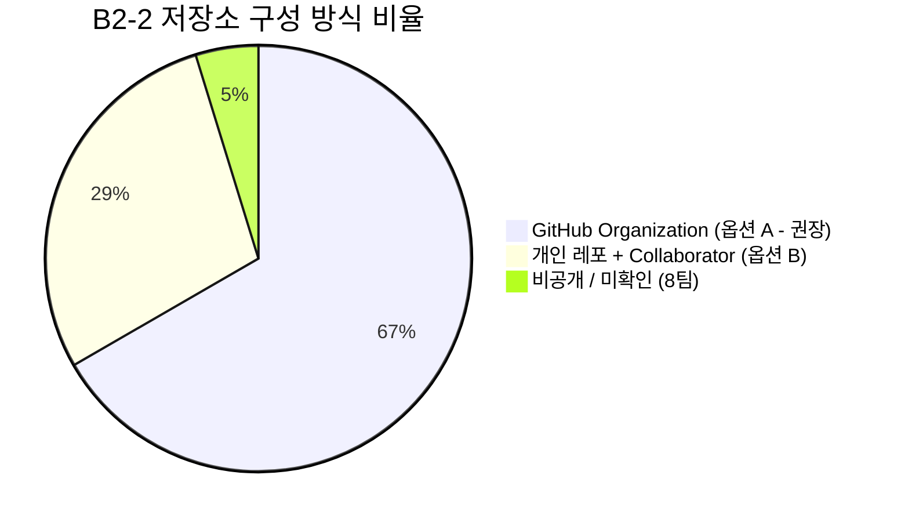

# B2-2 통과 팀 저장소 구성 유형 분석 (Organization vs 개인 레포)

- **기준일**: 2026-09-22
- **대상**: B2-2 미션 통과 21개 팀
- **관련 과제 요구사항**: [`instruction.md`](../instruction.md) (저장소 준비: 옵션 A 권장 vs 옵션 B 대체)

---

## 1. 전수 조사 요약

과제 명세서에서는 저장소 준비 방식으로 다음 2가지를 제시했습니다.
- **옵션 A (권장)**: GitHub Organization 저장소 생성
- **옵션 B (대체)**: 개인 저장소 생성 후 Collaborator 초대

실제 21개 팀의 저장소 소유자 계정 유형(GitHub API `type` 필드)을 전수 확인한 결과입니다.

- **GitHub Organization (옵션 A)**: **14개 팀 (66.7%)** - 압도적 다수
- **개인 레포 + Collaborator (옵션 B)**: **6개 팀 (28.6%)**
- **비공개 / 미확인**: **1개 팀 (4.8%)** (8팀)

---

## 2. 팀별 상세 분류 현황

### 🏢 [옵션 A] GitHub Organization으로 진행한 팀 (14팀)

팀 전용 독립 Organization을 생성하고 그 하위에 메인 저장소를 생성한 팀들입니다.

| 팀 | Organization 이름 | 저장소 명 | 특징 및 운용 방식 |
|:---:|:---|:---|:---|
| **1팀** | `codyssey-b2-2-team-mission` | `git-flow-utility-lab` | Org 메인 저장소 중심 협업 |
| **3팀** | `codyssey-2-mission` | `git-flow-demo` | Org 저장소 운용 + 팀원 개인 Fork 병행 |
| **4팀** | `codyssey-git` | `B2-2` | 깔끔한 과제 단위 Org 운용 |
| **5팀** | `CodysseyBMB` | `02.02-Git_Collaboration` | 팀원 이름 이니셜(BMB) 조합 Org |
| **6팀** | `GitTeamWorkflow` | `Codyssey_2-2` | 워크플로우 실습 전용 Org |
| **10팀** | `codyssey-git-workflow` | `codyssey_git_workflow` | Org 기반 협업 및 팀 소개 운용 |
| **11팀** | `codyssey-git-collaboration` | `mission` | 협업 전용 Org 생성 |
| **14팀** | `codyssey-b2-2-02` | `codyssey-b2-2-02` | Org 저장소 운용 + 팀원 개인 Fork 병행 |
| **15팀** | `codyssey-git-team` | `git-team` | 팀 전용 협업 Org |
| **16팀** | `gitflow-practice-team` | `github-workflow-practice` | Org 저장소 운용 + 팀원 개인 Fork 병행 |
| **17팀** | `c-b2-2` | `make-program-with-friends` | 과제명 직관적 Org 운용 |
| **18팀** | `B2-2-Cody` | `git-collab-mission` | 팀 전용 Org 운용 |
| **19팀** | `codyssey-b2-2-nlk` | `git-exercise` | 팀원 이니셜(nlk) 조합 Org |
| **20팀** | `Codyssey2-2` | `cody2-2Assign` | 2인 팀임에도 Org 생성하여 진행 |

---

### 👤 [옵션 B] 개인 저장소 + Collaborator 초대로 진행한 팀 (6팀)

팀원 중 1명의 개인 GitHub 계정에 저장소를 생성하고 나머지 팀원을 Collaborator로 초대한 팀들입니다.

| 팀 | 레포 생성자 (Owner) | 저장소 명 | 초대된 팀원 |
|:---:|:---|:---|:---|
| **2팀** | `Im-Jongseok` (이종석) | `Git_Collaboration` | 김병철(`feelosophysics`), 백동재(`VectorSophie`) |
| **7팀** | `mackerel07` (서채훈) | `B2-2` | 김명률(`eryu1i`), 김우종(`wilderif`), 김창환(`kimch0612`) |
| **9팀** | `hkk-cody` (김한규) | `b2-2` | 권창범(`7eerup`), 서예영(`s-yeyeong`) |
| **12팀** | `zxcv718` (임익화) | `b2_2` *(비공개)* | 이규민(`dolphin1404`), 송지윤(`js910`) |
| **13팀** | `Daeung-03` (김대웅) | `Codyssey-b2-2` | 김정현(`kimjexnghyexn`), 김승우(`stevenkim18`) |
| **21팀** | `jha21vvv` (안재현) | `codyssey-b2-02` | 강동하(`Deviskido`), 김진우(`wlsdn66597`) |

---

### 🔒 [특이사항] 8팀 및 12팀 비공개 배경

1. **8팀 (`xifoxy-ru`, `solbao-dev`, `heejeong13`)**:
   - 팀원 전원의 공개 계정, 이벤트, 커밋 이력을 전수 추적했으나 공개 협업 저장소가 확인되지 않음. 통과 후 Private 전환 또는 삭제됨.
2. **12팀 (`js910`, `dolphin1404`, `zxcv718`)**:
   - Codyssey 플랫폼에 등록된 공식 제출 URL은 팀장 임익화(`zxcv718`)의 `https://github.com/zxcv718/b2_2`였으나 현재 404(Private).
   - 팀원 `dolphin1404`의 공개 레포지토리 `codyssey-b2-2`는 B2-1 가계부 개인 코드만 들어있는 초기 개인 흔적임이 확인됨.

---

## 3. 우리 팀을 위한 의사결정 가이드

### 결론: `GitHub Organization (옵션 A)` 생성을 강력 권장

1. **과제 요구사항 부합**: 과제 명세서에서 명시적으로 `옵션 A(권장)`으로 지정되어 있고, 통과팀의 약 70%가 이를 선택했습니다.
2. **실무 시뮬레이션 일치**: 실무에서는 특정 개인 계정이 아닌 조직(Org) 아래 저장소를 관리하며, 팀원 전원이 동등한 오너/멤버 권한을 가집니다.
3. **포트폴리오 증빙**: 팀원 전원의 GitHub 프로필에 Organization 뱃지가 생성되며, 메인 저장소를 각자 Fork하여 PR을 날리는 오픈소스형 실무 워크플로우를 경험할 수 있습니다.
4. **권한 및 Branch Protection**: Organization 단위에서 팀원 권한(Role) 및 `main` 브랜치 보호 규칙(PR 필수, 1명 이상 Approve)을 설정하는 과정 자체가 과제 핵심 학습 목표에 직결됩니다.
