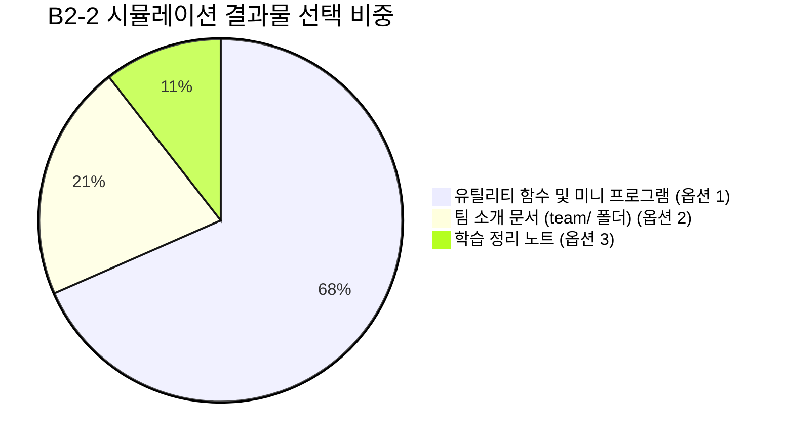

# B2-2 팀 협업 시뮬레이션 주제 및 구현 내용 전수 분석

- **기준일**: 2026-09-22
- **분석 대상**: 로컬에 클론된 19개 통과 팀 저장소 전수 코드/문서 분석
- **관련 과제 요구사항**: [`instruction.md`](../instruction.md) (2. 최종 결과물 - "간단한 결과물" 택 1)

---

## 1. 개요 및 선택 유형 분포

과제 명세서에서 제시한 3가지 결과물 옵션 중, 각 팀이 실제로 어떤 주제와 코드로 시뮬레이션을 수행했는지 전수 조사한 결과입니다.

- **옵션 1 (유틸 함수 / 미니 프로그램)**: **13개 팀 (68.4%)** - 압도적 다수
- **옵션 2 (팀 소개 문서 / `team/` 폴더)**: **4개 팀 (21.1%)**
- **옵션 3 (학습 정리 노트)**: **2개 팀 (10.5%)**

> [!NOTE]
> 2팀, 3팀, 16팀 등 일부 팀은 **유틸리티 코드 + 팀 소개/학습 노트를 복합적으로 병행**하여 제출했습니다.

---

## 2. 유형별 상세 분석

### 🛠️ 유형 A: 유틸리티 함수 및 미니 프로그램 (13개 팀)

가장 많은 팀이 선택한 방식으로, 팀원 각자가 모듈/함수를 분담 개발하면서 **공통 진입점(`main.py`)이나 공통 유틸 파일에서 의도적인 충돌(Conflict)**을 발생시키기 가장 유리합니다.

#### 1) 표준 유틸리티 모듈 모음 (8개 팀)
팀원별로 문자열(String), 수학(Math), 날짜(Date), 리스트/컬렉션(List) 처리 함수를 분담 작성:
- **1팀 (`git-flow-utility-lab`)**: `src/team_utils.py` (문자열 뒤집기, 소수 판별 등)
- **2팀 (`Git_Collaboration`)**: `src/utils.py` (날짜 포맷터, 리스트 연산 등) + `team/` 소개 병행
- **4팀 (`B2-2`)**: `src/data_utils.py`, `src/text_utils.py`
- **5팀 (`02.02-Git_Collaboration`)**: `src/utils/` (`collection_utils.py`, `date_utils.py`, `number_utils.py`, `string_utils.py`)
- **11팀 (`mission`)**: `src/` (`common_utils.py`, `list_utils.py`, `math_utils.py`, `number_utils.py`, `string_utils.py`)
- **13팀 (`Codyssey-b2-2`)**: `src/example.py`, `src/python_functions_example.py`
- **15팀 (`git-team`)**: `src/utils/` (`date_utils.py`, `formatters.py`, `greeting.py`, `list_utils.py`, `math_utils.py`)
- **18팀 (`git-collab-mission`)**: `src/string_utils.py`, `src/__init__.py`

#### 2) 사칙연산 CLI 계산기 프로그램 (4개 팀)
팀원들이 덧셈, 뺄셈, 곱셈, 나눗셈 또는 파서를 나누어 구현:
- **3팀 (`git-flow-demo`)**: `src/calculator/` (`calculator.py`, `main.py`, `parser.py`) - uv 패키지 매니저 및 pytest 테스트 구축
- **7팀 (`B2-2`)**: `src/calculator/` (`add.py`, `subtract.py`, `multiply.py`, `divide.py`)
- **14팀 (`codyssey-b2-2-02`)**: `src/` (`base_operation.py`, `add_operation.py`, `sub.py`, `mul.py`) - 객체지향 연산 구조
- **17팀 (`make-program-with-friends`)**: `src/` (`main.py`, `subtract.py`, `divide.py`)

#### 3) 인터랙티브 미니 게임 (1개 팀)
- **21팀 (`codyssey-b2-02`)**: 음식 이상형 월드컵 CLI 토너먼트 프로그램
  - `src/food_loader.py` (데이터 로더)
  - `src/tournament.py` (토너먼트 대진 로직)
  - `src/tie_breaker.py` (동점 처리기)
  - `src/game.py` (게임 루프 및 메인 실행기)

---

### 👥 유형 B: 팀 소개 문서 (`team/` 폴더) (4개 팀)

코딩 대신 팀원 각자의 마크다운 문서를 만들고, `README.md`에서 이를 취합하는 방식입니다.

- **10팀 (`codyssey_git_workflow`)**:
  - `team/mov-hyun.md`, `team/star-candy.md`, `team/yun-lim.md`
  - 팀원별 자기소개, 관심 기술 스택, Git 협업 목표 작성
- **16팀 (`github-workflow-practice`)**:
  - `teams/Introduce.md`, `jeongbeen.md`, `juseong.md`, `minwoo.md`, `park.md`, `taedong.md`
  - 팀원별 자기소개 + 개인별 Git 학습 요약 노트를 통합 구성
- **19팀 (`git-exercise`)**:
  - `team/README.md`, `team/graph.png` (팀원 프로필 및 커밋 그래프 증빙)
- **20팀 (`cody2-2Assign`)**:
  - `team/member-1.md`, `team/member-2.md`, `team/member-3.md` (팀원별 역할 정의서)

---

### 📝 유형 C: 학습 정리 노트 (2개 팀)

Git/GitHub의 내부 동작 원리와 트러블슈팅 명령어를 팀원들이 나누어 깊이 있게 탐구하고 정리한 방식입니다.

- **6팀 (`Codyssey_2-2`)**:
  - `practice-notes/` 폴더 아래 팀원별(Park, Son, Lim) 폴더 생성
  - Branch Protection Rule 설정 스크린샷 10여 종
  - `reset` vs `revert` vs `stash` vs `amend` 실습 재현 로그 및 스크린샷 수십 장 첨부
  - `calculator_lee_lim.py`로 충돌 실습도 함께 수행
- **9팀 (`b2-2`)**:
  - `docs/learning_notes/` 폴더에 `hkk-notes.md`, `kcb-notes.md`, `syy-notes.md` 수록
  - Git 트러블슈팅(`reflog`, `stash pop`, `revert`) 전 과정을 터미널 캡처로 상세 문서화

---

## 3. 실제 충돌(Conflict) 및 협업 시뮬레이션 방식

각 팀이 과제 요구사항을 만족하기 위해 실제로 충돌을 유도하고 해결한 패턴은 다음과 같습니다.

### 패턴 1: 공통 진입점(`main.py`) 동시 수정 (유틸/계산기 팀)
1. 팀원 A가 `main.py`에 자신이 만든 모듈(`add`, `string_utils`)을 import하고 실행 코드를 추가하여 `main`에 PR/Merge.
2. 팀원 B가 팀원 A의 코드를 `pull` 받지 않은 상태에서 자신의 모듈(`multiply`, `math_utils`)을 `main.py` 같은 위치에 추가하고 PR 시도.
3. GitHub 또는 로컬 병합 시 **충돌(Conflict) 발생**.
4. 로컬에서 `git merge origin/main` 후 `<<<<<<<`, `=======`, `>>>>>>>` 마커를 확인하고 두 모듈을 모두 호출하도록 수정하여 해결 후 push.

### 패턴 2: `README.md` 목차 / 소개 섹션 동시 수정 (문서 팀)
1. `README.md`의 팀원 소개 목차 테이블이나 기여 목록 섹션의 동일한 라인을 여러 팀원이 각자 브랜치에서 동시에 편집.
2. PR 병합 시 마크다운 파일 충돌을 경험하고, 팀 회의를 거쳐 두 사람의 내용을 모두 보존하는 방식으로 해결.

---

## 4. 우리 팀을 위한 추천 가이드

### 추천 주제: **"간단한 파이썬 유틸리티 모음"** 또는 **"사칙연산 계산기"** (옵션 1)

1. **충돌 재현의 용이성**:
   - `src/utils/` 아래 각자 맡은 파일(`string_utils.py`, `math_utils.py`, `date_utils.py`)은 독립적으로 작업하되,
   - 최상위 `src/main.py`에 각자의 함수를 등록하는 과정에서 **의도적인 충돌**을 아주 깔끔하고 안전하게 만들 수 있습니다.
2. **테스트 코드(pytest) 연계**:
   - 3팀처럼 각 유틸리티 함수에 대한 단위 테스트 1~2개씩만 작성해도 CI/CD 및 코드 리뷰(PR) 시 "테스트 통과 여부"를 근거로 리뷰하는 실무 경험을 쌓을 수 있습니다.
3. **학습 비용 최소화**:
   - 복잡한 비즈니스 로직을 짤 필요 없이 단순한 10~20줄짜리 함수만 작성하면 되므로, **Git 협업(브랜치 전략, PR, 리뷰, 충돌 해결, 트러블슈팅)**이라는 본질적인 과제 목표에 온전히 집중할 수 있습니다.
