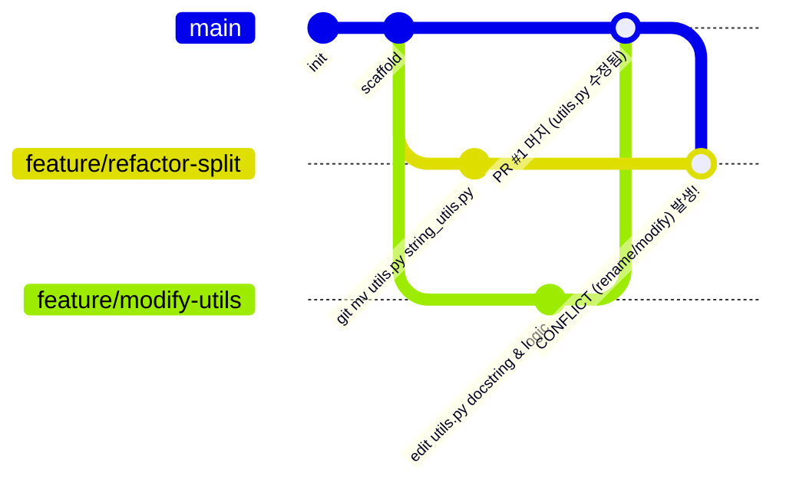

# B2-2 현실적인 실무형 협업 충돌 시나리오 심층 분석 및 추천

- **기준일**: 2026-09-22
- **분석 대상**: 19개 통과 팀 저장소의 `conflict-resolution.md`, `SCENARIO.md`, 커밋 이력 전수 분석
- **핵심 목표**: 인위적인 "5번째 줄 동시 수정"이 아닌, **서로 다른 Feature를 독립 개발하면서도 실무처럼 자연스럽게 발생하는 충돌 환경** 구성

---

## 1. 현실적 시나리오를 가장 잘 설계한 우수 팀 TOP 2

19개 팀 중 단순히 "README 5번째 줄 같이 고치기" 수준을 넘어, **실무 개발 워크플로우와 자연스러운 충돌 접점을 가장 탁월하게 설계한 팀은 `18팀`과 `21팀`**입니다.

---

### 🏆 BEST 1: 18팀 (`B2-2-Cody/git-collab-mission`)
> **"사전 실행 대본(`SCENARIO.md`)을 수립하고, 실무 리팩토링 충돌(Rename vs Modify)을 완벽 구현"**

18팀은 과제 시작 전 **[`docs/SCENARIO.md`](../repos/team_18_B2-2-Cody__git-collab-mission/docs/SCENARIO.md)**라는 7.6KB 분량의 치밀한 팀 실행 대본을 먼저 작성하고 진행했습니다.



#### 18팀의 충돌 시나리오 설계
1. **자명한 충돌 (add/add)**:
   - 두 개발자가 아직 `src/utils.py`가 없는 `main` 브랜치에서 각자 브랜치를 따서 각자의 기능(문자열 유틸 vs 리스트 유틸)을 담은 `src/utils.py`를 새로 생성.
   - 한 명이 먼저 머지된 후 다른 한 명이 머지할 때 `CONFLICT (add/add)` 발생. (양쪽 함수를 모두 보존하며 해결)
2. **비자명한 충돌 (Rename vs Modify - 실무 100% 반영)**:
   - **상황**: 팀원 A가 코드 냄새를 제거하기 위해 `git mv src/utils.py src/string_utils.py`로 파일명을 변경(리팩토링)하는 동안, 팀원 B는 버그 수정/기능 개선을 위해 `src/utils.py` 내부 로직을 수정하여 `main`에 먼저 머지함.
   - **결과**: `git merge` 시 `src/utils.py`는 삭제(`D`)로, `src/string_utils.py`는 충돌(`UU`)로 표시되는 `CONFLICT (rename/modify)` 발생.
   - **해결**: Git의 3-Way 병합 동작을 이해하고, 이동된 새 파일(`string_utils.py`)에 수정된 내용을 이식한 뒤 구 파일을 정리.

---

### 🏆 BEST 2: 21팀 (`jha21vvv/codyssey-b2-02`)
> **"음식 이상형 월드컵 미니 도메인 기반 데이터셋 병합 & 모듈 책임 분리 충돌"**

21팀은 단순 유틸이 아니라 **"음식 이상형 월드컵 토너먼트 CLI"**라는 그럴듯한 미니 프로그램을 만들고, 도메인 개발 과정에서 자연스럽게 발생하는 충돌을 유도했습니다.

#### 21팀의 충돌 시나리오 설계
1. **공통 데이터셋 인접 라인 충돌 (`food_data.json`)**:
   - 팀원 A는 기존 음식 항목의 오탈자 정제 및 속성 수정 작업을 진행.
   - 팀원 B는 새 메뉴(순두부찌개 등)를 데이터셋에 추가하고 포맷팅 개선.
   - `main` 병합 시 JSON 배열의 인접 라인에서 충돌 발생 -> 데이터 유실 없이 두 사람의 변경사항을 JSON 문법에 맞게 통합(`Clean Data Selection & Keep Both`).
2. **모듈 명명 리팩토링 충돌 (`lottery.py` ➔ `tie_breaker.py`)**:
   - 팀원 A가 추첨 로직의 의미를 명확히 하고자 `lottery.py`를 `tie_breaker.py`로 `git mv`.
   - 팀원 B는 `lottery.py` 내부의 동점자 추첨 알고리즘을 개선 중이었음.
   - 머지 시 `CONFLICT (rename/modify)` 발생 -> 변경된 표준 파일명(`tie_breaker.py`)에 개선된 알고리즘을 이식하여 통합.

---

## 2. 실무에서 "서로 다른 기능" 개발 시 충돌이 터지는 4대 접점

실무에서 개발자들은 분명 완전히 다른 티켓(Feature)을 작업하는데도 충돌을 겪습니다. 그 이유는 소프트웨어 아키텍처 상 반드시 마주치는 **공유 접점(Shared Touchpoints)**이 존재하기 때문입니다.

```
                    ┌─────────────────────────┐
                    │     Shared Touchpoint   │
                    │ (Router / Registry / DB)│
                    └───────────┬─────────────┘
                                │
        ┌───────────────────────┴───────────────────────┐
        ▼                                               ▼
┌───────────────────────┐                       ┌───────────────────────┐
│ Feature A (팀원 1)    │                       │ Feature B (팀원 2)    │
│ 예: 결제/주문 기능     │                       │ 예: 회원/쿠폰 기능     │
│ - 주문 커맨드 등록    │                       │ - 쿠폰 커맨드 등록    │
└───────────────────────┘                       └───────────────────────┘
```

### 접점 1: CLI 커맨드 등록소 / 라우터 (`cli.py` / `main.py`)
- **실무 맥락**: 기능 A(예: 검색 기능)와 기능 B(예: 통계 리포트 기능)는 각자 `services/search.py`, `services/stats.py`로 완전히 분리되어 있지만, 사용자가 터미널에서 부를 수 있게 하려면 최상위 `main.py`나 `argparse` 서브파서 등록부에 커맨드를 등록해야 합니다.
- **충돌 원리**: 같은 `subparsers.add_parser(...)` 블록 아래에 각자의 명령어를 등록하려다 충돌 발생.

### 접점 2: 공유 데이터 모델 / 설정 파일 (`models.py`, `config.py`)
- **실무 맥락**: 기능 A 개발자는 데이터 모델에 `created_at` 필드나 `status` Enum을 추가하고, 기능 B 개발자는 `updated_at` 필드나 `tags` 필드를 추가함.
- **충돌 원리**: 같은 클래스 정의부(`class Item:`) 내부 필드 선언 위치에서 충돌 발생.

### 접점 3: 패키지 진입점 (`__init__.py`)
- **실무 맥락**: 각자 새 모듈을 만들고 외부에서 편하게 import할 수 있도록 `src/__init__.py`의 `__all__` 리스트에 자기 모듈을 export하려 할 때 발생.

### 접점 4: 구조 개선(Refactoring / Rename) vs 기능 수정 (비자명 충돌)
- **실무 맥락**: 한 개발자가 기술 부채 해결을 위해 폴더 구조를 개편하거나 파일명을 의미에 맞게 변경(`git mv`)하고 있는데, 다른 개발자가 그 파일의 기능을 수정하고 있을 때 발생.

---

## 3. 우리 팀을 위한 현실적인 추천 시나리오 (3~4인 기준)

단순 유틸이 아니라, **"실무 CLI 도구(예: 간단한 할 일/프로젝트 매니저 또는 북마크 CLI)"**를 테마로 잡고 아래와 같이 역할을 배정하면 100% 현실적인 협업과 충돌이 완성됩니다.

### 📋 프로젝트 테마 예시: `TaskTracker CLI`

```
task_tracker/
  ├── src/
  │    ├── main.py          <-- [충돌 접점 1: CLI 서브커맨드 등록]
  │    ├── models.py        <-- [충돌 접점 2: 공유 데이터 스키마]
  │    ├── storage.py       <-- [충돌 접점 3: 리팩토링 vs 기능 개선 (비자명 충돌)]
  │    ├── tasks.py         (팀원 1 담당: 할 일 추가/완료 기능)
  │    └── stats.py         (팀원 2 담당: 통계/요약 리포트 기능)
  ├── docs/
  └── tests/
```

### 🎬 단계별 실전 충돌 시나리오 연출법

#### 1단계: 자명한 충돌 (CLI 커맨드 등록 충돌)
- **팀원 1 (`feature/add-task`)**: `tasks.py` 구현 후 `main.py`의 `subparsers`에 `add` 명령어를 등록하고 PR/머지.
- **팀원 2 (`feature/show-stats`)**: 최신 `main`을 당겨받지 않은 채, `stats.py` 구현 후 `main.py`의 같은 라인에 `stats` 명령어를 등록하고 PR 생성.
- **결과**: `main.py`에서 `CONFLICT (content)` 발생!
- **해결**: 둘 중 한 명이 로컬에서 `git merge origin/main` 후 두 명령어가 모두 정상 등록되도록 병합.

#### 2단계: 비자명한 충돌 (리팩토링 vs 버그 수정)
- **팀원 3 (`feature/refactor-storage`)**: `storage.py`의 역할이 커지자 `git mv src/storage.py src/json_storage.py`로 파일명을 바꾸고 클래스명을 정돈함.
- **팀원 1 (`feature/fix-storage-encoding`)**: 같은 시점에 기존 `src/storage.py`의 파일 열기 옵션에 `encoding='utf-8'` 버그 패치를 적용하여 `main`에 먼저 머지함.
- **결과**: 팀원 3이 머지하려 할 때 `CONFLICT (rename/modify)` 발생!
- **해결**: 팀원 3이 `json_storage.py` 내부에 팀원 1의 `utf-8` 인코딩 패치 코드를 이식하고, 잔여 `storage.py`는 `git rm` 처리.

---

## 4. 요약 및 참고 링크

- 가장 완벽한 벤치마킹 대상: **18팀 [`docs/SCENARIO.md`](../repos/team_18_B2-2-Cody__git-collab-mission/docs/SCENARIO.md)** 및 **21팀 [`docs/conflict-resolution.md`](../repos/team_21_jha21vvv__codyssey-b2-02/docs/conflict-resolution.md)**
- 이 구조를 적용하면 **과제 평가 문항(비자명 충돌 1회 포함 필수)**을 완벽하게 만족할 뿐 아니라, "우리는 실무 아키텍처 접점에서 발생하는 충돌을 시뮬레이션했다"는 강력한 포트폴리오 스토리가 완성됩니다.
