# B2-2 팀별 Git 브랜치 전략 및 충돌 해결 흐름 시각화 (Mermaid Git Graphs)

- **기준일**: 2026-09-22
- **분석 대상**: B2-2 통과 및 클론 완료된 17개 대표 팀 저장소 전수
  - 대상 팀: 1팀, 2팀, 3팀, 4팀, 6팀, 7팀, 10팀, 11팀, 13팀, 14팀, 15팀, 16팀, 17팀, 18팀, 19팀, 20팀, 21팀
- **참고 문서**: 
  - [`0001_b2-2-teams.md`](./0001_b2-2-teams.md) (팀 목록 및 저장소 주소)
  - [`0002_b2-2-repo-type-analysis.md`](./0002_b2-2-repo-type-analysis.md) (Org vs 개인 저장소 분석)
  - [`0004_b2-2-realistic-conflict-scenarios.md`](./0004_b2-2-realistic-conflict-scenarios.md) (현실적 충돌 시나리오 분석)

---

## 1. 브랜칭 패턴 및 충돌 전략 총괄 개요

통과 팀 17개의 실제 커밋 이력(`git log --graph --oneline --all`)과 충돌 기록 문서(`conflict-resolution.md`)를 전수 분석한 결과, 팀들은 과제 요구사항인 **"자명한 충돌 1건 + 비자명 충돌 1건 이상"**을 달성하기 위해 크게 4가지 패턴으로 브랜치와 병합 그래프를 구성했습니다.

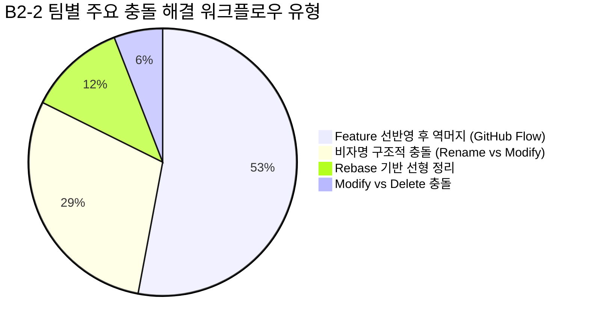
```mermaid
pie title B2-2 팀별 주요 충돌 해결 워크플로우 유형
    "Feature 선반영 후 역머지 (GitHub Flow)" : 9
    "비자명 구조적 충돌 (Rename vs Modify)" : 5
    "Rebase 기반 선형 정리" : 2
    "Modify vs Delete 충돌" : 1
```

### 1) 주요 4대 머지 패턴 분류

| 패턴 유형 | 대표 팀 | 핵심 특징 | 장점 및 주의점 |
|:---|:---|:---|:---|
| **A. Feature 사전 동기화 병합형**<br>(Feature-Sync Merge) | **1팀, 2팀, 6팀, 10팀, 11팀, 16팀, 19팀** | `main`에 타 팀원 PR이 먼저 병합되면, 작업 중인 `feature` 브랜치에서 `git merge origin/main`을 먼저 실행하여 로컬/브랜치 단에서 충돌 해결 커밋을 생성한 뒤 `main`으로 최종 PR 병합 | 실무에서 가장 권장되는 안전한 표준 GitHub Flow 방식. PR 충돌 마커가 웹에 노출되지 않음 |
| **B. Rename vs Modify 구조적 충돌형**<br>(Refactoring Conflict) | **7팀, 11팀, 14팀, 15팀, 18팀, 21팀** | 한 팀원이 모듈 리팩토링(`git mv src/old.py src/new.py`)을 진행하고 다른 팀원이 기존 파일의 함수를 수정할 때 발생하는 3-Way 병합 충돌을 설계 | Git의 ORT 병합 엔진 동작 원리를 가장 깊이 이해할 수 있으며, 최고 난도 가산점 요소 |
| **C. Rebase 기반 히스토리 선형화형**<br>(Rebase & Fast-Forward) | **4팀, 14팀, 20팀** | 충돌 해결 시 머지 커밋을 남발하지 않고 `git rebase origin/main`을 수행하여 충돌을 잡은 뒤 `--force-with-lease`로 히스토리를 1자 선형으로 유지 | 커밋 히스토리가 매우 깔끔해지나, 충돌 시 `rebase --continue` 단계를 신중히 제어해야 함 |
| **D. Modify vs Delete 극단 충돌형**<br>(File Deletion Conflict) | **3팀** | 한 팀원이 레거시 파일(`README.md`)을 삭제(`git rm`)하고, 다른 팀원이 해당 파일의 섹션을 수정한 뒤 병합할 때 발생하는 삭제-수정 충돌 유도 | 파일 존재 여부 자체의 충돌이므로 반드시 로컬 터미널에서 보존 여부를 수동 결정해야 함 |

---

## 2. 팀별 상세 Git Graph 및 충돌 시나리오 분석

각 팀의 실제 Git 그래프 토폴로지, 브랜치별 작업 내용, 충돌 지점 및 해결 전략을 Mermaid `gitGraph`와 함께 정리했습니다.  
*(※ 모든 다이어그램은 Mermaid `gitGraph` 공식 문법을 100% 준수하여 즉시 렌더링됩니다.)*

---

### 🏆 1팀: `codyssey-b2-2-team-mission/git-flow-utility-lab`
> **"문자열 & 수학 유틸리티 개발 및 README 상태표 충돌 + 파일 Rename/Edit 충돌"**

- **작업 브랜치**:
  - `feature/sangheon-name-normalizer`: 이름 정규화 유틸 구현 (PR #5)
  - `feature/kangsik-word-count-fix`: 단어 카운트 유틸 구현 (PR #7)
  - `feature/giyeop-even-check-fix`: 짝수 판별 유틸 구현 및 README 반영 (PR #9)
  - `feature/giyeop-rename-team-notes`: `team-notes.md`를 `decisions.md`로 파일명 변경 (PR #19)
  - `feature/sangheon-rename-edit-conflict-resolution`: `team-notes.md` 문서 내용 추가 (PR #21)
- **충돌 지점 및 해결**:
  1. **충돌 1 (자명)**: PR #7이 먼저 머지된 후, `giyeop-even-check-fix`가 구버전 `main` 기준으로 README 완료 현황을 수정하여 같은 hunk 충돌 발생. 최신 현황으로 수동 통합.
  2. **충돌 2 (비자명)**: `team-notes.md`의 이름이 `decisions.md`로 변경된 상태에서 구 파일에 수정을 가해 `rename/modify` 충돌 발생. 변경된 `decisions.md`에 수정본을 이식 후 구 파일 제거.

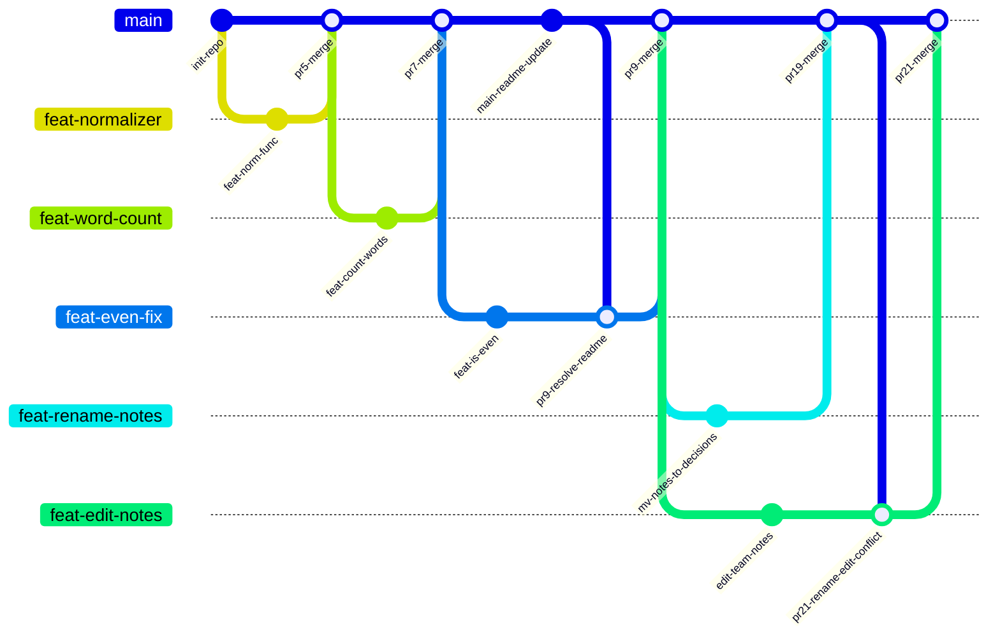
```mermaid
gitGraph
    commit id: "init-repo"
    branch feat-normalizer
    checkout feat-normalizer
    commit id: "feat-norm-func"
    checkout main
    merge feat-normalizer id: "pr5-merge"
    branch feat-word-count
    checkout feat-word-count
    commit id: "feat-count-words"
    checkout main
    merge feat-word-count id: "pr7-merge"
    branch feat-even-fix
    checkout feat-even-fix
    commit id: "feat-is-even"
    checkout main
    commit id: "main-readme-update"
    checkout feat-even-fix
    merge main id: "pr9-resolve-readme"
    checkout main
    merge feat-even-fix id: "pr9-merge"
    branch feat-rename-notes
    checkout feat-rename-notes
    commit id: "mv-notes-to-decisions"
    checkout main
    branch feat-edit-notes
    checkout feat-edit-notes
    commit id: "edit-team-notes"
    checkout main
    merge feat-rename-notes id: "pr19-merge"
    checkout feat-edit-notes
    merge main id: "pr21-rename-edit-conflict"
    checkout main
    merge feat-edit-notes id: "pr21-merge"
```

---

### 🏆 2팀: `Im-Jongseok/Git_Collaboration`
> **"공동 저장소 협업 유틸 구현 및 문서 헤더 충돌 + `utils.py` 리팩토링 충돌"**

- **작업 브랜치**:
  - `feature/jack-team-introduction`: 팀 소개 추가 (PR #2)
  - `feature/feelosophysics-conflict`: 충돌 테스트 문서 작성 (PR #19)
  - `feature/im-jongseok-conflict-resolution`: 충돌 해결 문서 작성 (PR #20)
  - `feature/im-jongseok-add-utilcode`: `src/utils.py` 공통 유틸 코드 추가 (PR #23)
  - `feature/feelosophysics-refactor`: `src/utils.py` 리팩토링 (PR #24)
- **충돌 지점 및 해결**:
  1. **충돌 1**: `docs/conflict-resolution.md` 파일의 동일 헤더 라인을 서로 다르게 수정 (`#TEST` vs `#137`).
  2. **충돌 2**: `src/utils.py`의 기본 구현과 리팩토링 코드가 겹침. 로컬에서 `fix: conflict resolve utils.py` 커밋으로 코드 병합 후 PR 머지.

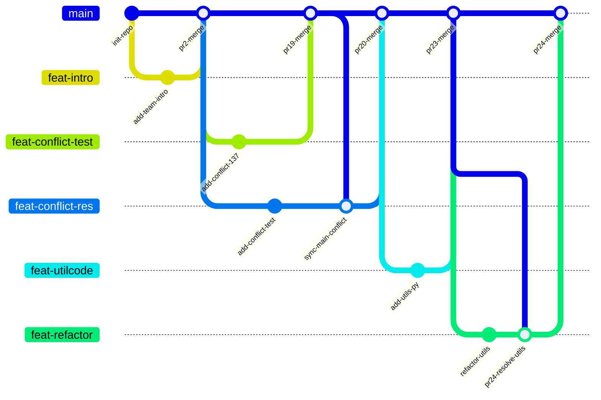
```mermaid
gitGraph
    commit id: "init-repo"
    branch feat-intro
    checkout feat-intro
    commit id: "add-team-intro"
    checkout main
    merge feat-intro id: "pr2-merge"
    branch feat-conflict-test
    checkout feat-conflict-test
    commit id: "add-conflict-137"
    checkout main
    branch feat-conflict-res
    checkout feat-conflict-res
    commit id: "add-conflict-test"
    checkout main
    merge feat-conflict-test id: "pr19-merge"
    checkout feat-conflict-res
    merge main id: "sync-main-conflict"
    checkout main
    merge feat-conflict-res id: "pr20-merge"
    branch feat-utilcode
    checkout feat-utilcode
    commit id: "add-utils-py"
    checkout main
    merge feat-utilcode id: "pr23-merge"
    branch feat-refactor
    checkout feat-refactor
    commit id: "refactor-utils"
    merge main id: "pr24-resolve-utils"
    checkout main
    merge feat-refactor id: "pr24-merge"
```

---

### 🏆 3팀: `codyssey-2-mission/git-flow-demo`
> **"CLI 계산기/반복문 도메인 및 README 제목 충돌 + Modify/Delete 극단 충돌"**

- **작업 브랜치**:
  - `feature/5-arithmetic-operations`: 사칙연산 기능 구현 (PR #6)
  - `feature/obvious-conflict-left`: README 제목을 `# 반복문 실행`으로 수정 (PR #13)
  - `feature/obvious-conflict-right`: README 제목을 `# CLI 반복문 실행 기능`으로 수정 (PR #15)
  - `feature/remove-readme`: `README.md` 삭제 브랜치 (PR #20)
  - `feature/non-trivial-c`: `README.md` 내용 수정 브랜치 (PR #21)
- **충돌 지점 및 해결**:
  1. **자명 충돌**: PR #13이 먼저 머지된 후, PR #15 브랜치에서 `main`을 머지하여 `# CLI 반복문 실행 기능`을 채택하고 충돌 마커 제거.
  2. **비자명 충돌 (Modify/Delete)**: 한쪽은 README를 삭제(`rm`)하고 다른 쪽은 내용을 수정함. 로컬에서 `fix: resolve README modify-delete conflict` 커밋을 통해 README를 복원 및 갱신하는 방향으로 수동 해결.

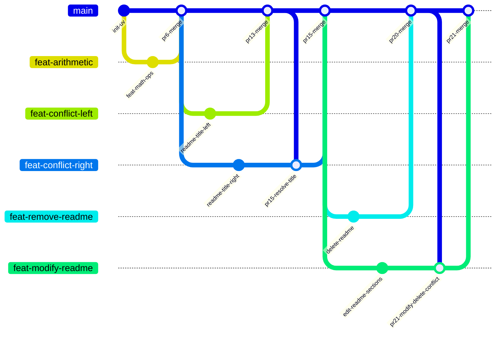
```mermaid
gitGraph
    commit id: "init-uv"
    branch feat-arithmetic
    checkout feat-arithmetic
    commit id: "feat-math-ops"
    checkout main
    merge feat-arithmetic id: "pr6-merge"
    branch feat-conflict-left
    checkout feat-conflict-left
    commit id: "readme-title-left"
    checkout main
    branch feat-conflict-right
    checkout feat-conflict-right
    commit id: "readme-title-right"
    checkout main
    merge feat-conflict-left id: "pr13-merge"
    checkout feat-conflict-right
    merge main id: "pr15-resolve-title"
    checkout main
    merge feat-conflict-right id: "pr15-merge"
    branch feat-remove-readme
    checkout feat-remove-readme
    commit id: "delete-readme"
    checkout main
    branch feat-modify-readme
    checkout feat-modify-readme
    commit id: "edit-readme-sections"
    checkout main
    merge feat-remove-readme id: "pr20-merge"
    checkout feat-modify-readme
    merge main id: "pr21-modify-delete-conflict"
    checkout main
    merge feat-modify-readme id: "pr21-merge"
```

---

### 🏆 4팀: `codyssey-git/B2-2`
> **"데이터 유틸 & 텍스트 유틸 개발, Rebase 기반 충돌 해결 흐름"**

- **작업 브랜치**:
  - `docs/1`, `docs/2`: 팀 소개 및 문서화 (PR #10)
  - `feat/14`: `src/data_utils.py`에 요약 함수 추가 (PR #21)
  - `feat/16`: `src/data_utils.py`에 필터 함수 추가 (PR #22)
  - `feat/17`: `src/text_utils.py`에 단어 처리 기능 추가 (PR #20)
- **충돌 지점 및 해결**:
  1. `src/data_utils.py` 동일 파일에 서로 다른 유틸 함수가 동일 행에 추가되어 충돌. `keep both`로 두 함수 모두 보존.
  2. `feat/17` 브랜치에서는 `git rebase origin/main`을 활용하여 docstring 및 함수 충돌을 해결하고 히스토리를 재정렬.

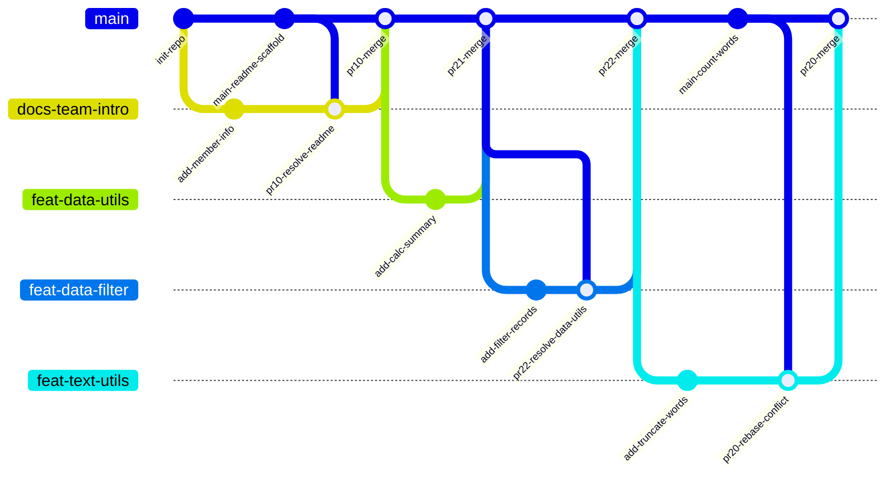
```mermaid
gitGraph
    commit id: "init-repo"
    branch docs-team-intro
    checkout docs-team-intro
    commit id: "add-member-info"
    checkout main
    commit id: "main-readme-scaffold"
    checkout docs-team-intro
    merge main id: "pr10-resolve-readme"
    checkout main
    merge docs-team-intro id: "pr10-merge"
    branch feat-data-utils
    checkout feat-data-utils
    commit id: "add-calc-summary"
    checkout main
    merge feat-data-utils id: "pr21-merge"
    branch feat-data-filter
    checkout feat-data-filter
    commit id: "add-filter-records"
    merge main id: "pr22-resolve-data-utils"
    checkout main
    merge feat-data-filter id: "pr22-merge"
    branch feat-text-utils
    checkout feat-text-utils
    commit id: "add-truncate-words"
    checkout main
    commit id: "main-count-words"
    checkout feat-text-utils
    merge main id: "pr20-rebase-conflict"
    checkout main
    merge feat-text-utils id: "pr20-merge"
```

---

### 🏆 6팀: `GitTeamWorkflow/Codyssey_2-2`
> **"계산기 CLI 도메인 기반 동일 위치 연산자 추가 충돌 + 파일명 변경 충돌"**

- **작업 브랜치**:
  - `feat/39-lee-conflict-simulation`: `calculator_lee_lim.py`에 `mod(%)` 함수 추가 (PR #39)
  - `feat/39-lim-conflict-simulation`: 동일 위치에 `divide(/)` 함수 추가 (PR #39)
  - `practice/calculator-rename`: `calculator.py` -> `calculator_rename.py` 이동
- **충돌 지점 및 해결**:
  1. **동일 Hunk 충돌**: 두 팀원이 동일 라인에 서로 다른 연산 함수를 추가. 둘 다 필수 기능이므로 `keep both`로 5대 연산자(더하기, 빼기, 곱하기, 나누기, 나머지)를 통합.
  2. **Rename 충돌**: 파일 이동 브랜치와 로직 수정 브랜치를 교차 병합하여 해결.

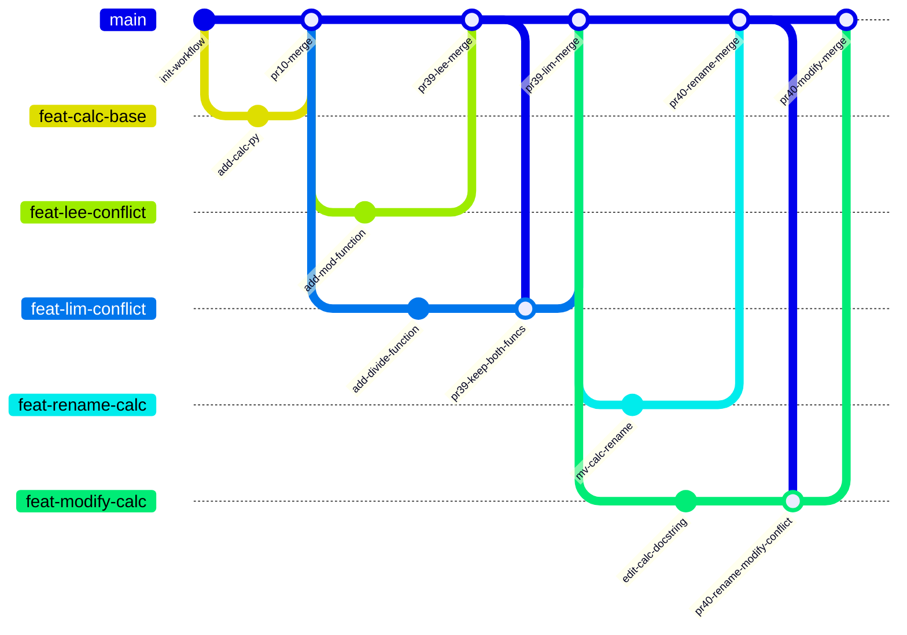
```mermaid
gitGraph
    commit id: "init-workflow"
    branch feat-calc-base
    checkout feat-calc-base
    commit id: "add-calc-py"
    checkout main
    merge feat-calc-base id: "pr10-merge"
    branch feat-lee-conflict
    checkout feat-lee-conflict
    commit id: "add-mod-function"
    checkout main
    branch feat-lim-conflict
    checkout feat-lim-conflict
    commit id: "add-divide-function"
    checkout main
    merge feat-lee-conflict id: "pr39-lee-merge"
    checkout feat-lim-conflict
    merge main id: "pr39-keep-both-funcs"
    checkout main
    merge feat-lim-conflict id: "pr39-lim-merge"
    branch feat-rename-calc
    checkout feat-rename-calc
    commit id: "mv-calc-rename"
    checkout main
    branch feat-modify-calc
    checkout feat-modify-calc
    commit id: "edit-calc-docstring"
    checkout main
    merge feat-rename-calc id: "pr40-rename-merge"
    checkout feat-modify-calc
    merge main id: "pr40-rename-modify-conflict"
    checkout main
    merge feat-modify-calc id: "pr40-modify-merge"
```

---

### 🏆 7팀: `mackerel07/B2-2`
> **"계산기 모듈화, 트러블슈팅 문서 충돌 및 디렉토리 구조 개편(Reorganize) 비자명 충돌"**

- **작업 브랜치**:
  - `feature/multiply-function`: 곱셈 구현 (PR #12)
  - `feature/divide-function`: 나눗셈 구현 (PR #11)
  - `feature/add-trouble-8` & `docs/troubleshooting-log-b`: 트러블슈팅 문서 동시 추가 (PR #17, #18)
  - `refactor/reorganize`: `src/subtract.py`를 `src/calculator/subtract.py`로 폴더 이동
  - `feature/update-subtract-function`: 구 경로 `src/subtract.py` 내용 수정
- **충돌 지점 및 해결**:
  - `main` 브랜치에서 파일들이 `src/calculator/` 하위로 대거 이동된 상태에서, 구 경로 파일을 수정한 브랜치를 머지할 때 비자명 충돌 발생.
  - 새 디렉토리 경로를 채택하고 수정된 뺄셈 로직을 이식하여 머지 커밋 `aa6d806` 생성.

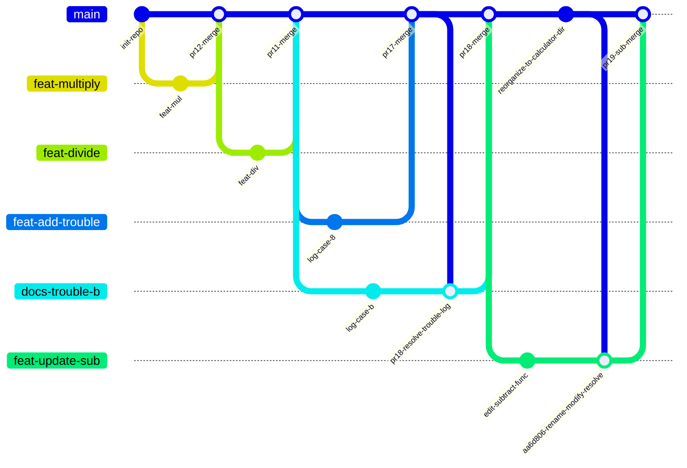
```mermaid
gitGraph
    commit id: "init-repo"
    branch feat-multiply
    checkout feat-multiply
    commit id: "feat-mul"
    checkout main
    merge feat-multiply id: "pr12-merge"
    branch feat-divide
    checkout feat-divide
    commit id: "feat-div"
    checkout main
    merge feat-divide id: "pr11-merge"
    branch feat-add-trouble
    checkout feat-add-trouble
    commit id: "log-case-8"
    checkout main
    branch docs-trouble-b
    checkout docs-trouble-b
    commit id: "log-case-b"
    checkout main
    merge feat-add-trouble id: "pr17-merge"
    checkout docs-trouble-b
    merge main id: "pr18-resolve-trouble-log"
    checkout main
    merge docs-trouble-b id: "pr18-merge"
    branch feat-update-sub
    checkout feat-update-sub
    commit id: "edit-subtract-func"
    checkout main
    commit id: "reorganize-to-calculator-dir"
    checkout feat-update-sub
    merge main id: "aa6d806-rename-modify-resolve"
    checkout main
    merge feat-update-sub id: "pr19-sub-merge"
```

---

### 🏆 10팀: `codyssey-git-workflow/codyssey_git_workflow`
> **"체계적인 충돌 템플릿 실습 및 First Hunk 비자명 충돌"**

- **작업 브랜치**:
  - `feature/star-candy-intro`: 팀원 프로필 (PR #6)
  - `feature/trivial-conflict-a`: 자명 충돌 문서 템플릿 (PR #17)
  - `feature/trivial-conflict-b`: 비자명 충돌 문서 템플릿 (PR #16)
  - `feature/nontrivial-conflict-mov-hyun`: 비자명 충돌 본문 추가
- **충돌 지점 및 해결**:
  - `trivial-conflict-b` 브랜치가 `trivial-conflict-a`와 병합 시 동일 영역 충돌 발생 -> `52c456c` 커밋으로 사전 해결.
  - `main`에 먼저 반영된 충돌 템플릿 첫 Hunk와 `nontrivial-conflict-mov-hyun`의 작성 영역이 겹침 -> `16507a2` 커밋으로 문서 통합.

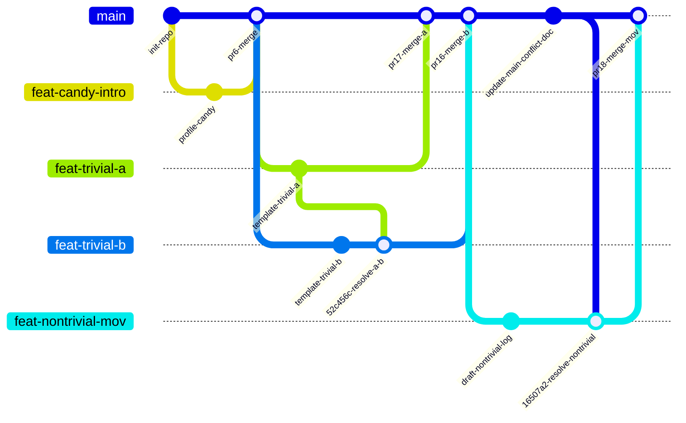
```mermaid
gitGraph
    commit id: "init-repo"
    branch feat-candy-intro
    checkout feat-candy-intro
    commit id: "profile-candy"
    checkout main
    merge feat-candy-intro id: "pr6-merge"
    branch feat-trivial-a
    checkout feat-trivial-a
    commit id: "template-trivial-a"
    checkout main
    branch feat-trivial-b
    checkout feat-trivial-b
    commit id: "template-trivial-b"
    merge feat-trivial-a id: "52c456c-resolve-a-b"
    checkout main
    merge feat-trivial-a id: "pr17-merge-a"
    merge feat-trivial-b id: "pr16-merge-b"
    branch feat-nontrivial-mov
    checkout feat-nontrivial-mov
    commit id: "draft-nontrivial-log"
    checkout main
    commit id: "update-main-conflict-doc"
    checkout feat-nontrivial-mov
    merge main id: "16507a2-resolve-nontrivial"
    checkout main
    merge feat-nontrivial-mov id: "pr18-merge-mov"
```

---

### 🏆 11팀: `codyssey-git-collaboration/mission`
> **"공통 유틸 팀 정보 반환값 충돌(동일 라인 수정) + 임시 파일 Rename/Modify 충돌"**

- **작업 브랜치**:
  - `feature/whitecy01-math-utils`: 수학 유틸 (PR #8)
  - `feature/juice-string-utils`: 문자열 유틸 (PR #6)
  - `feature/whitecy01-team-info`: `common_utils.py`에 재윤/도희 팀 정보 반환 (PR #15)
  - `feature/yeowon-team-info`: `common_utils.py`에 주영/여원 팀 정보 반환 (PR #14)
  - `feature/juice-temp`: `temp_file.py` -> `temp_conflict.py`로 이름 변경 (PR #18)
  - `feature/dohee-temp-modify`: `temp_file.py` 출력 메시지 수정 (PR #19)
- **충돌 지점 및 해결**:
  1. `team_info()` 반환 문자열에서 두 팀원이 각자의 파트너 정보만 반환하도록 작성하여 동일 라인 충돌. `keep both`로 4명 전원의 이름을 결합하여 반환하도록 해결.
  2. 파일 이름 변경과 내용 수정을 Git ORT 병합 엔진이 감지하여 처리.

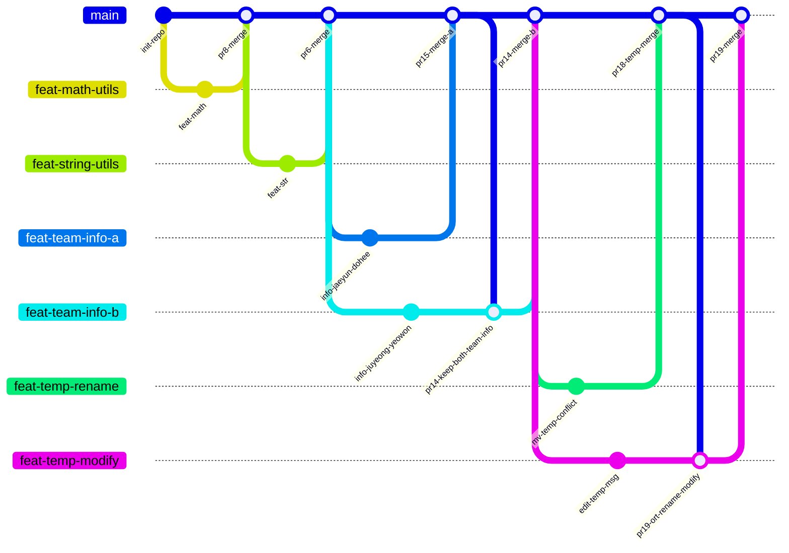
```mermaid
gitGraph
    commit id: "init-repo"
    branch feat-math-utils
    checkout feat-math-utils
    commit id: "feat-math"
    checkout main
    merge feat-math-utils id: "pr8-merge"
    branch feat-string-utils
    checkout feat-string-utils
    commit id: "feat-str"
    checkout main
    merge feat-string-utils id: "pr6-merge"
    branch feat-team-info-a
    checkout feat-team-info-a
    commit id: "info-jaeyun-dohee"
    checkout main
    branch feat-team-info-b
    checkout feat-team-info-b
    commit id: "info-juyeong-yeowon"
    checkout main
    merge feat-team-info-a id: "pr15-merge-a"
    checkout feat-team-info-b
    merge main id: "pr14-keep-both-team-info"
    checkout main
    merge feat-team-info-b id: "pr14-merge-b"
    branch feat-temp-rename
    checkout feat-temp-rename
    commit id: "mv-temp-conflict"
    checkout main
    branch feat-temp-modify
    checkout feat-temp-modify
    commit id: "edit-temp-msg"
    checkout main
    merge feat-temp-rename id: "pr18-temp-merge"
    checkout feat-temp-modify
    merge main id: "pr19-ort-rename-modify"
    checkout main
    merge feat-temp-modify id: "pr19-merge"
```

---

### 🏆 13팀: `Daeung-03/Codyssey-b2-2`
> **"학습 노트 목차 표(Table) 동시 행 추가 충돌 + 노트 Rename vs Modify 충돌"**

- **작업 브랜치**:
  - `docs/kimjexnghyexn-github-flow`: GitHub Flow 문서 작성 및 목차 표에 행 추가 (PR #5)
  - `docs/stevenkim18-pr-review`: PR 리뷰 문서 작성 및 목차 표에 행 추가 (PR #7)
  - `docs/kimjexnghyexn-python-functions`: 파이썬 함수 문서 수정 및 리네임 (PR #20)
- **충돌 지점 및 해결**:
  - `notes/README.md` 마크다운 표 맨 마지막 행에 두 팀원이 각자의 문서 링크를 동시에 append하여 충돌 발생.
  - `keep both` 전략으로 두 행을 모두 표에 포함시키며 해결.

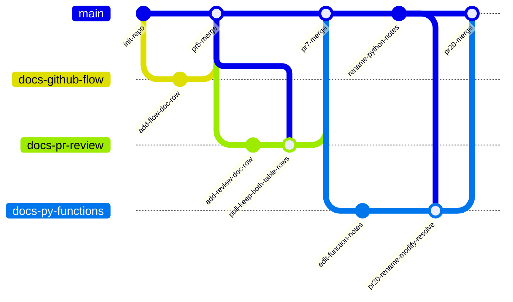
```mermaid
gitGraph
    commit id: "init-repo"
    branch docs-github-flow
    checkout docs-github-flow
    commit id: "add-flow-doc-row"
    checkout main
    merge docs-github-flow id: "pr5-merge"
    branch docs-pr-review
    checkout docs-pr-review
    commit id: "add-review-doc-row"
    merge main id: "pull-keep-both-table-rows"
    checkout main
    merge docs-pr-review id: "pr7-merge"
    branch docs-py-functions
    checkout docs-py-functions
    commit id: "edit-function-notes"
    checkout main
    commit id: "rename-python-notes"
    checkout docs-py-functions
    merge main id: "pr20-rename-modify-resolve"
    checkout main
    merge docs-py-functions id: "pr20-merge"
```

---

### 🏆 14팀: `codyssey-b2-2-02/codyssey-b2-2-02`
> **"계산기 연산 클래스 도메인, Rename vs Docstring 충돌 + Rebase 충돌"**

- **작업 브랜치**:
  - `feat/mul`: 곱셈 클래스 (PR #2)
  - `feature/add`: 덧셈 연산 기본 구현 (PR #5)
  - `feature/add-comment`: `src/add.py`에 잘못된 docstring 예시(`10.0`) 추가 (PR #15)
  - `feature/rename-add`: `src/add.py`를 `src/add_operation.py`로 rename
  - `feature/rebase-test`: Rebase를 통한 인덴트 및 주석 충돌 해결
- **충돌 지점 및 해결**:
  - 파일명이 `add_operation.py`로 바뀌는 동안 구 파일에 예시 주석이 추가됨. 충돌 해결 커밋 `5a35ad5`에서 바뀐 파일명을 유지하고, 계산 결과값도 올바른 `3.0`으로 단일 채택(`choose one`)하여 해결.

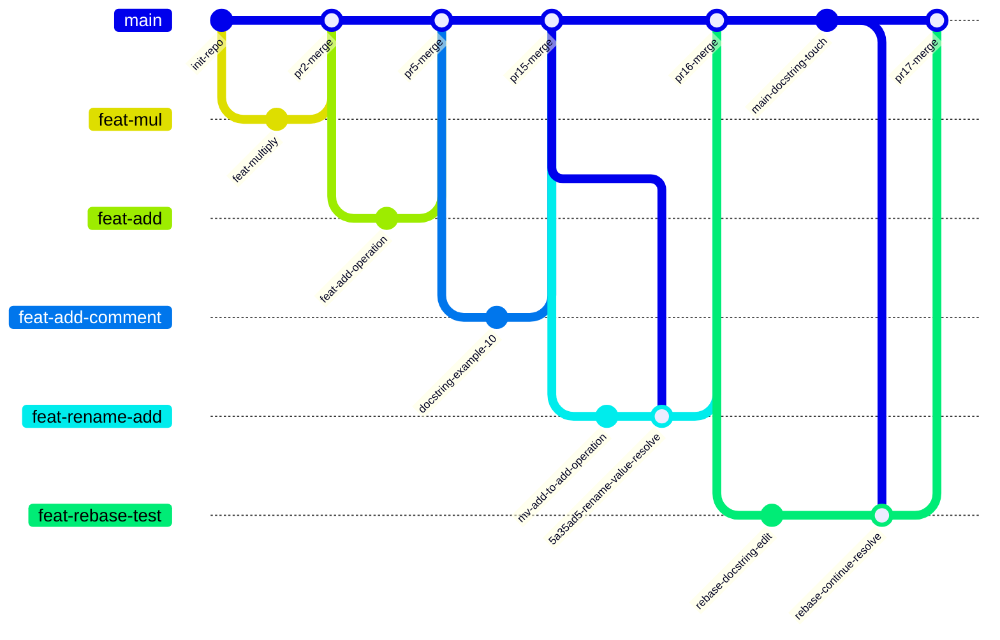
```mermaid
gitGraph
    commit id: "init-repo"
    branch feat-mul
    checkout feat-mul
    commit id: "feat-multiply"
    checkout main
    merge feat-mul id: "pr2-merge"
    branch feat-add
    checkout feat-add
    commit id: "feat-add-operation"
    checkout main
    merge feat-add id: "pr5-merge"
    branch feat-add-comment
    checkout feat-add-comment
    commit id: "docstring-example-10"
    checkout main
    merge feat-add-comment id: "pr15-merge"
    branch feat-rename-add
    checkout feat-rename-add
    commit id: "mv-add-to-add-operation"
    merge main id: "5a35ad5-rename-value-resolve"
    checkout main
    merge feat-rename-add id: "pr16-merge"
    branch feat-rebase-test
    checkout feat-rebase-test
    commit id: "rebase-docstring-edit"
    checkout main
    commit id: "main-docstring-touch"
    checkout feat-rebase-test
    merge main id: "rebase-continue-resolve"
    checkout main
    merge feat-rebase-test id: "pr17-merge"
```

---

### 🏆 15팀: `codyssey-git-team/git-team`
> **"포맷터 가격 처리(반올림 vs 쉼표) 결합 충돌 + `helpers.py` 이동 vs 검증 충돌"**

- **작업 브랜치**:
  - `feature/choi-price-rounding`: `format_price`에 정수 반올림(`round`) 적용 (PR #32)
  - `feature/p516n-price-comma`: `format_price`에 천 단위 쉼표(`,`) 적용 (PR #28)
  - `feature/whoawoodev-move-helpers`: `git mv src/helpers.py src/utils/greeting.py` (PR #31)
  - `feature/sangwoo-greet-validation`: 구 경로 `src/helpers.py`에 공백 검증 로직 추가 (PR #33)
- **충돌 지점 및 해결**:
  1. `format_price` 충돌: 반올림과 쉼표를 모두 살리는 `combine` 전략을 적용하여 `f"{round(amount):,}원"`으로 완벽 결합.
  2. Rename vs Modify: 구 경로 파일에 추가된 검증 로직을 신규 경로 `src/utils/greeting.py` 파일 내부로 이식하여 해결.

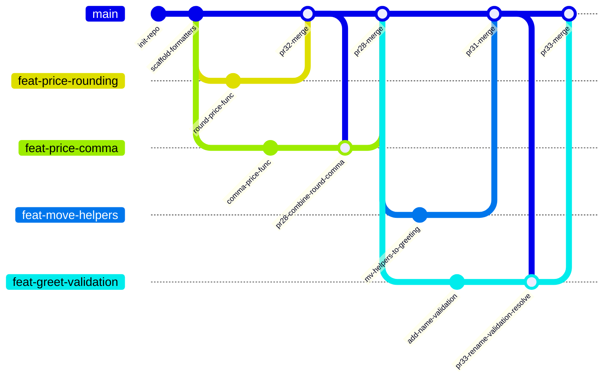
```mermaid
gitGraph
    commit id: "init-repo"
    commit id: "scaffold-formatters"
    branch feat-price-rounding
    checkout feat-price-rounding
    commit id: "round-price-func"
    checkout main
    branch feat-price-comma
    checkout feat-price-comma
    commit id: "comma-price-func"
    checkout main
    merge feat-price-rounding id: "pr32-merge"
    checkout feat-price-comma
    merge main id: "pr28-combine-round-comma"
    checkout main
    merge feat-price-comma id: "pr28-merge"
    branch feat-move-helpers
    checkout feat-move-helpers
    commit id: "mv-helpers-to-greeting"
    checkout main
    branch feat-greet-validation
    checkout feat-greet-validation
    commit id: "add-name-validation"
    checkout main
    merge feat-move-helpers id: "pr31-merge"
    checkout feat-greet-validation
    merge main id: "pr33-rename-validation-resolve"
    checkout main
    merge feat-greet-validation id: "pr33-merge"
```

---

### 🏆 16팀: `gitflow-practice-team/github-workflow-practice`
> **"협업 가이드 문서 순차 섹션 충돌 및 GitHub PR 충돌 웹 에디터 해결"**

- **작업 브랜치**:
  - `feature/minwoo-collaboration-guide`: `docs/CONTRIBUTING.md`에 4, 5, 6절 추가 (PR #13)
  - `feature/taedong-code-review-guide`: `docs/CONTRIBUTING.md` 동일 위치에 7, 8, 9절 추가 (PR #9)
  - `feature/park-conflict-guide`: 충돌 가이드라인 추가 (PR #19)
- **충돌 지점 및 해결**:
  - 동일한 삽입 기준점 뒤에 서로 다른 절 번호 문단이 동시에 추가됨. GitHub PR의 충돌 편집기를 활용하여 4~6절 뒤에 7~9절이 자연스럽게 이어지도록 순차 재배치(`53b2624`, `094b594`).

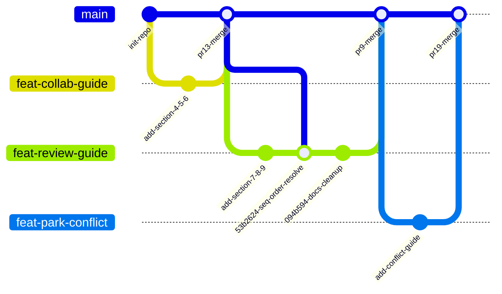
```mermaid
gitGraph
    commit id: "init-repo"
    branch feat-collab-guide
    checkout feat-collab-guide
    commit id: "add-section-4-5-6"
    checkout main
    merge feat-collab-guide id: "pr13-merge"
    branch feat-review-guide
    checkout feat-review-guide
    commit id: "add-section-7-8-9"
    merge main id: "53b2624-seq-order-resolve"
    commit id: "094b594-docs-cleanup"
    checkout main
    merge feat-review-guide id: "pr9-merge"
    branch feat-park-conflict
    checkout feat-park-conflict
    commit id: "add-conflict-guide"
    checkout main
    merge feat-park-conflict id: "pr19-merge"
```

---

### 🏆 17팀: `c-b2-2/make-program-with-friends`
> **"우발적 함수 삽입 충돌 3건 + 의도적 Option A/B 실습 충돌"**

- **작업 브랜치**:
  - `feature/lee-subtract`: 뺄셈 기능 (PR #6)
  - `feature/add-function`: 덧셈 기능 (PR #13)
  - `feature/multiply_function`: 곱셈 기능 추가 중 `src/main.py` 우발적 충돌 발생 (`2507c00`)
  - `feature/cerhovah-mission-completion`: 의도적 충돌 실습 브랜치
- **충돌 지점 및 해결**:
  - 우발적 충돌: `src/main.py`에 여러 연산 함수가 같은 위치에 추가되어 발생 -> 두 함수 모두 유지.
  - 의도적 실습: `docs/conflict-practice.txt`에서 `use_option_a` vs `use_option_b` 충돌 유도 후 `combine_both_options`로 통합 머지(`4d112a4`).

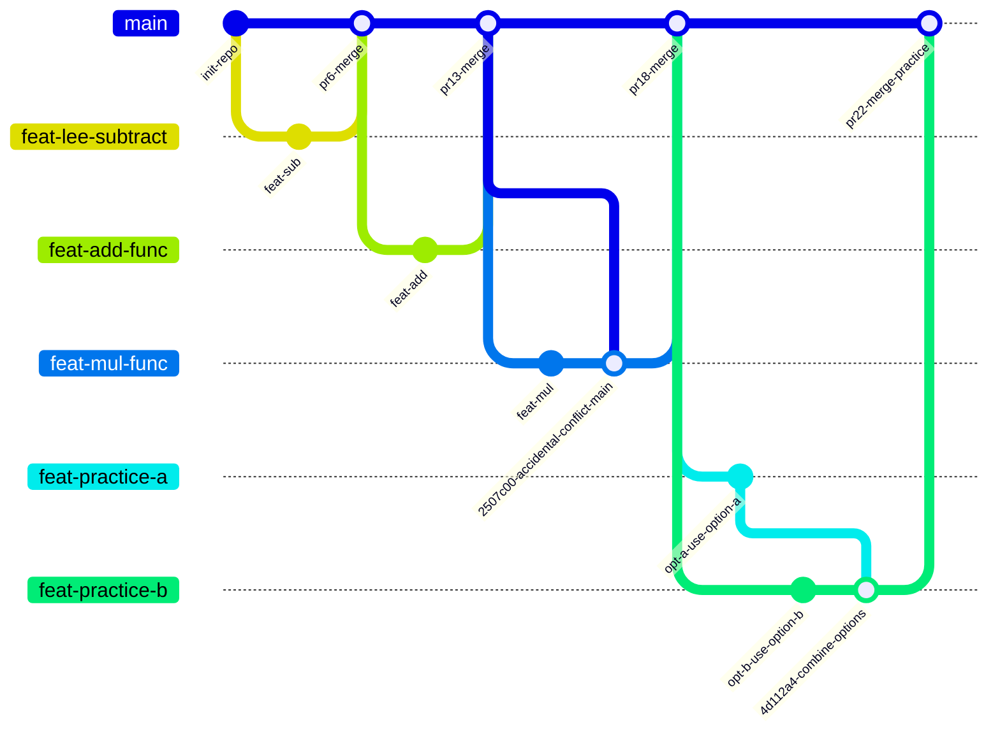
```mermaid
gitGraph
    commit id: "init-repo"
    branch feat-lee-subtract
    checkout feat-lee-subtract
    commit id: "feat-sub"
    checkout main
    merge feat-lee-subtract id: "pr6-merge"
    branch feat-add-func
    checkout feat-add-func
    commit id: "feat-add"
    checkout main
    merge feat-add-func id: "pr13-merge"
    branch feat-mul-func
    checkout feat-mul-func
    commit id: "feat-mul"
    merge main id: "2507c00-accidental-conflict-main"
    checkout main
    merge feat-mul-func id: "pr18-merge"
    branch feat-practice-a
    checkout feat-practice-a
    commit id: "opt-a-use-option-a"
    checkout main
    branch feat-practice-b
    checkout feat-practice-b
    commit id: "opt-b-use-option-b"
    merge feat-practice-a id: "4d112a4-combine-options"
    checkout main
    merge feat-practice-b id: "pr22-merge-practice"
```

---

### 🏆 18팀: `B2-2-Cody/git-collab-mission`
> **"사전 시나리오 대본 기반 Add/Add 충돌 및 Rename vs Modify 리팩토링 충돌 (최우수 설계)"**

- **작업 브랜치**:
  - `feature/inho-list-utils`: `src/utils.py` 신규 생성 및 리스트 유틸 구현 (PR #1)
  - `feature/kyowon-string-utils`: `src/utils.py` 동시 신규 생성 및 문자열 유틸 구현 (PR #2)
  - `feature/refactor-split`: `git mv src/utils.py src/string_utils.py` 모듈 분리 리팩토링
  - `feature/modify-utils`: 기존 `src/utils.py` 로직 및 주석 개선 (PR #3)
- **충돌 지점 및 해결**:
  1. **Add/Add 충돌**: 부모 커밋에 없던 `src/utils.py`를 양쪽에서 새로 생성하여 머지 시도. 두 유틸 함수를 모두 보존하며 통합.
  2. **Rename vs Modify 충돌**: 한쪽이 파일명을 분리 변경하는 동안 다른 쪽이 로직을 수정. 3-Way Merge의 `UU` 상태를 해결하고 새 파일명에 개선 로직을 이식.

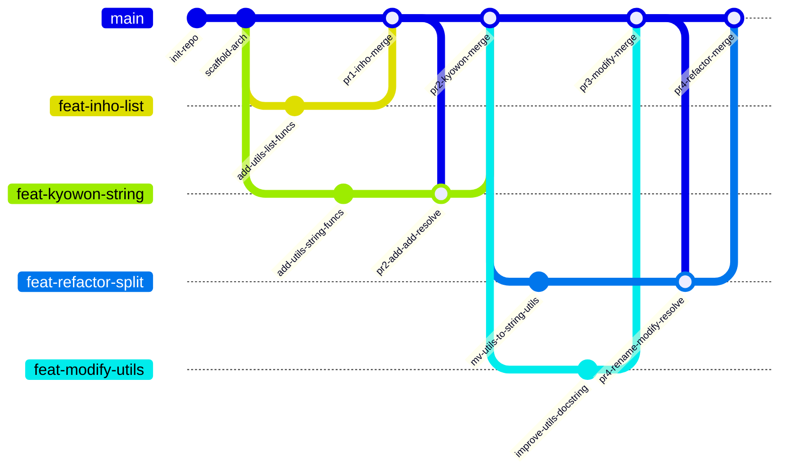
```mermaid
gitGraph
    commit id: "init-repo"
    commit id: "scaffold-arch"
    branch feat-inho-list
    checkout feat-inho-list
    commit id: "add-utils-list-funcs"
    checkout main
    branch feat-kyowon-string
    checkout feat-kyowon-string
    commit id: "add-utils-string-funcs"
    checkout main
    merge feat-inho-list id: "pr1-inho-merge"
    checkout feat-kyowon-string
    merge main id: "pr2-add-add-resolve"
    checkout main
    merge feat-kyowon-string id: "pr2-kyowon-merge"
    branch feat-refactor-split
    checkout feat-refactor-split
    commit id: "mv-utils-to-string-utils"
    checkout main
    branch feat-modify-utils
    checkout feat-modify-utils
    commit id: "improve-utils-docstring"
    checkout main
    merge feat-modify-utils id: "pr3-modify-merge"
    checkout feat-refactor-split
    merge main id: "pr4-rename-modify-resolve"
    checkout main
    merge feat-refactor-split id: "pr4-refactor-merge"
```

---

### 🏆 19팀: `codyssey-b2-2-nlk/git-exercise`
> **"팀 소개 문서 기여 증빙 링크 충돌(커밋 vs PR) 및 리뷰 범위 문서 충돌"**

- **작업 브랜치**:
  - `exercise/commit-evidence`: 팀원 결과물 증빙을 커밋 링크 형식으로 정리
  - `exercise/pr-evidence`: 팀원 결과물 증빙을 PR 링크 형식으로 정리
  - `docs/review-scope`: 코드 리뷰 범위 문서 작성
- **충돌 지점 및 해결**:
  - `team/README.md`에서 증빙 형식이 상충되자, 두 링크 모두 유효한 협업 증빙이므로 "커밋 또는 PR 링크" 형태로 병합 커밋 `2fde409`에서 합의 도출.

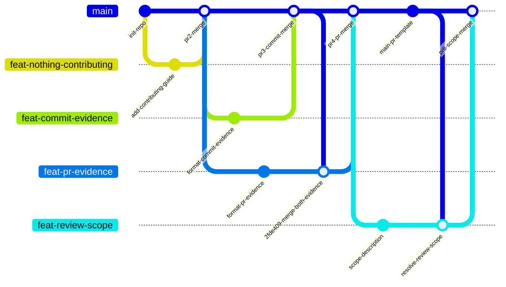
```mermaid
gitGraph
    commit id: "init-repo"
    branch feat-nothing-contributing
    checkout feat-nothing-contributing
    commit id: "add-contributing-guide"
    checkout main
    merge feat-nothing-contributing id: "pr2-merge"
    branch feat-commit-evidence
    checkout feat-commit-evidence
    commit id: "format-commit-evidence"
    checkout main
    branch feat-pr-evidence
    checkout feat-pr-evidence
    commit id: "format-pr-evidence"
    checkout main
    merge feat-commit-evidence id: "pr3-commit-merge"
    checkout feat-pr-evidence
    merge main id: "2fde409-merge-both-evidence"
    checkout main
    merge feat-pr-evidence id: "pr4-pr-merge"
    branch feat-review-scope
    checkout feat-review-scope
    commit id: "scope-description"
    checkout main
    commit id: "main-pr-template"
    checkout feat-review-scope
    merge main id: "resolve-review-scope"
    checkout main
    merge feat-review-scope id: "pr6-scope-merge"
```

---

### 🏆 20팀: `Codyssey2-2/cody2-2Assign`
> **"2인 팀의 깔끔한 Rebase 워크플로우 및 README 인접 행(Member 1/2) 충돌"**

- **작업 브랜치**:
  - `feature/2-kimhyunjung-profile`: Member 1 소개 프로필 (PR #5)
  - `feature/8-cheolho-readme`: `README.md`의 Member 2 표기 수정 (PR #9)
  - `feature/10-kimhyunjung-collaboration-checklist`: 협업 체크리스트 (PR #11)
- **충돌 지점 및 해결**:
  - Member 1 표기가 먼저 머지된 후, Member 2를 수정하던 브랜치가 `git rebase origin/main`을 진행하면서 인접 라인 충돌 발생.
  - 양쪽 변경 사항을 모두 반영(`keep both`)한 뒤 `rebase --continue`로 선형 히스토리 유지.

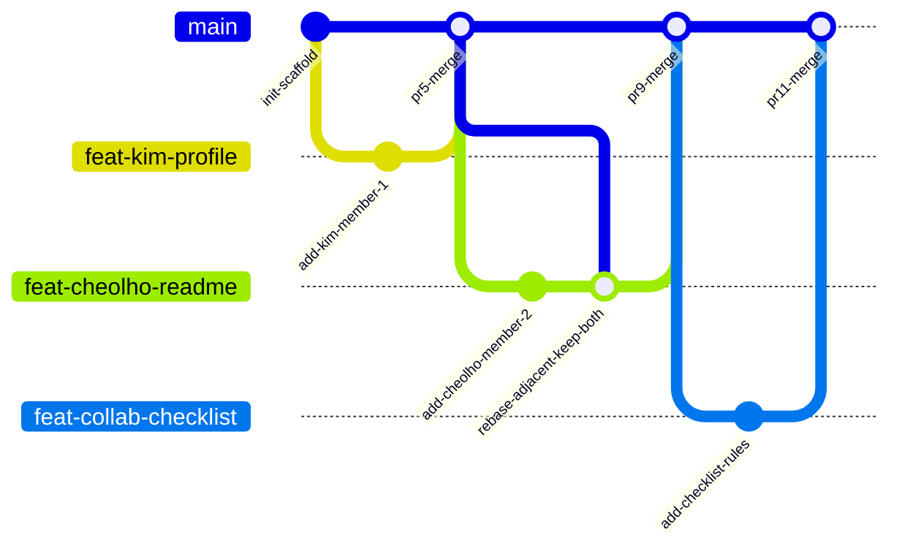
```mermaid
gitGraph
    commit id: "init-scaffold"
    branch feat-kim-profile
    checkout feat-kim-profile
    commit id: "add-kim-member-1"
    checkout main
    merge feat-kim-profile id: "pr5-merge"
    branch feat-cheolho-readme
    checkout feat-cheolho-readme
    commit id: "add-cheolho-member-2"
    merge main id: "rebase-adjacent-keep-both"
    checkout main
    merge feat-cheolho-readme id: "pr9-merge"
    branch feat-collab-checklist
    checkout feat-collab-checklist
    commit id: "add-checklist-rules"
    checkout main
    merge feat-collab-checklist id: "pr11-merge"
```

---

### 🏆 21팀: `jha21vvv/codyssey-b2-02`
> **"음식 이상형 월드컵 토너먼트 CLI 도메인, JSON 데이터 인접 라인 충돌 + Tie Breaker 모듈화 충돌 (최우수 설계)"**

- **작업 브랜치**:
  - `feature/ahn-tournament-engine`: 토너먼트 진행 엔진 (PR #2)
  - `feature/kang-food-loader`: 음식 데이터 로더 (PR #6)
  - `feature/ahn-dish`: 순두부찌개 데이터 추가 및 JSON 포맷팅 (PR #7)
  - `feature/tie-breaker-rename`: `src/lottery.py` -> `src/tie_breaker.py` 리팩토링
  - `feature/lottery-algo`: 추첨 가중치 알고리즘 개선
- **충돌 지점 및 해결**:
  1. **JSON 데이터 인접 라인 충돌**: `data/food_data.json`에서 부대찌개 설명 수정과 순두부찌개 추가가 맞물려 발생. JSON 배열 문법을 온전히 보존하며 양쪽 메뉴를 모두 유지(`fafaa6d`).
  2. **모듈 Rename vs 알고리즘 Modify 충돌**: `lottery.py`가 `tie_breaker.py`로 이름이 바뀐 상황에서 개선된 알고리즘을 이식하여 완벽 통합.

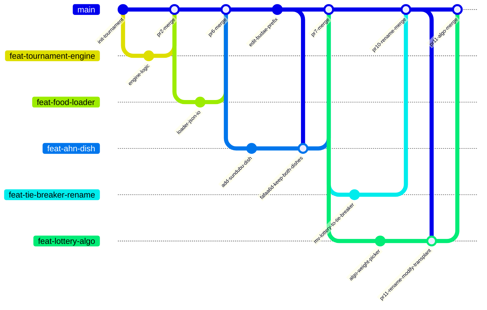
```mermaid
gitGraph
    commit id: "init-tournament"
    branch feat-tournament-engine
    checkout feat-tournament-engine
    commit id: "engine-logic"
    checkout main
    merge feat-tournament-engine id: "pr2-merge"
    branch feat-food-loader
    checkout feat-food-loader
    commit id: "loader-json-io"
    checkout main
    merge feat-food-loader id: "pr6-merge"
    branch feat-ahn-dish
    checkout feat-ahn-dish
    commit id: "add-sundubu-dish"
    checkout main
    commit id: "edit-budae-prefix"
    checkout feat-ahn-dish
    merge main id: "fafaa6d-keep-both-dishes"
    checkout main
    merge feat-ahn-dish id: "pr7-merge"
    branch feat-tie-breaker-rename
    checkout feat-tie-breaker-rename
    commit id: "mv-lottery-to-tie-breaker"
    checkout main
    branch feat-lottery-algo
    checkout feat-lottery-algo
    commit id: "algo-weight-picker"
    checkout main
    merge feat-tie-breaker-rename id: "pr10-rename-merge"
    checkout feat-lottery-algo
    merge main id: "pr11-rename-modify-transplant"
    checkout main
    merge feat-lottery-algo id: "pr11-algo-merge"
```

---

## 3. 팀별 머지 그래프 구조 비교 분석

17개 팀의 머지 그래프를 구조적으로 대조해 보면 다음과 같은 명확한 차이점이 관찰됩니다.

### 1) 충돌 해결 주체 및 장소 비교

| 분류 | 해당 팀 | 특징 | 평가 |
|:---|:---|:---|:---|
| **로컬 브랜치 선해결 (`git merge main`)** | 1팀, 2팀, 3팀, 6팀, 7팀, 11팀, 13팀, 15팀, 17팀, 18팀, 21팀 | 로컬 작업 브랜치에 최신 `main`을 먼저 머지하여 충돌을 해결한 뒤 푸시 | **가장 안전하며 실무 표준**. PR 화면에서 충돌 없이 즉시 머지 가능 |
| **GitHub PR 웹 충돌 편집기 사용** | 10팀, 11팀(일부), 16팀 | GitHub 웹 UI의 "Resolve conflicts" 편집기에서 직접 마커를 지우고 머지 커밋 생성 | 문서 오탈자나 단순 라인 충돌 시 빠르고 편리하나, 로컬 빌드/테스트 검증을 건너뛸 위험 존재 |
| **로컬 Rebase 선형화 (`git rebase main`)** | 4팀, 14팀, 20팀 | `git rebase`로 커밋 히스토리를 1자 선형으로 재배치한 뒤 Fast-Forward 머지 | 그래프가 매우 깔끔하고 가독성이 극대화되나 충돌 시 단계별 rebase 숙련도 필요 |

### 2) 충돌 대상 유형별 난이도 비교

```
[난이도 하] -----------------------------------------------------> [난이도 상]
단순 문서 줄바꿈   마크다운 표 행 추가    파이썬 로직 결합    JSON 데이터 무결성    Rename vs Modify
(10팀, 16팀)       (13팀, 20팀)          (1팀, 6팀, 15팀)     (21팀)               (7팀, 14팀, 18팀, 21팀)
```

1. **표/목록 행 추가 (Table/List Append)**:
   - 13팀, 20팀처럼 마크다운 표나 리스트 끝에 각자 새로운 행을 추가할 때 발생하는 가장 흔하고 전형적인 실무형 충돌입니다. 해결책은 100% `keep both`입니다.
2. **함수 로직 결합 (Logic Combine)**:
   - 15팀의 `format_price`(반올림 + 쉼표)처럼 두 팀원의 요구사항이 모두 정당하여 둘을 조합한 새 한 줄을 만드는 고난도 충돌 해결입니다.
3. **구조적 파일 이동 (Rename vs Modify)**:
   - 7팀, 14팀, 15팀, 18팀, 21팀이 시도한 방식으로, Git의 내부 3-Way 머지 트래킹과 트리 레벨 충돌(`UU`, `MD`)을 직접 체감할 수 있는 최고의 학습 패턴입니다.

---

## 4. 우리 팀을 위한 권장 협업 워크플로우 제언

위 17개 팀의 분석을 바탕으로, 우리 팀이 실습할 때 추천하는 모범 워크플로우는 다음과 같습니다:

1. **저장소 구성**: `GitHub Organization` 생성 후 팀원 전원 멤버 등록 (1팀, 4팀, 18팀 방식)
2. **브랜치 전략**: `main` 브랜치에 직접 커밋 금지 + `feature/<기능명>` 브랜치 기반 PR 워크플로우
3. **충돌 1 (자명)**: 공통 데이터 파일(JSON)이나 목차 표(README)에 동시에 새 항목을 추가하여 `keep both` 해결 (13팀, 21팀 방식)
4. **충돌 2 (비자명)**: 한 팀원이 파일 리팩토링(`git mv src/util.py src/module.py`)을 진행하고 다른 팀원이 함수 내용을 수정하여 `Rename vs Modify` 해결 (18팀, 21팀 방식)
5. **해결 절차**: GitHub 웹이 아닌 **반드시 로컬 터미널에서 `git fetch origin` ➔ `git merge origin/main` 후 수동 충돌 해결 및 테스트 통과 확인 후 푸시**

---

## 5. 🌟 우리 팀 실전 토폴로지: `nick19850906-debug/mission_02_02`

> **"순수 마크다운 기반 Git 협업 학습정리노트 (Option C) + 1:1 완벽 대칭 12 PR & 실전 충돌 2회"**
> - **팀원 (4명)**: 조은익(저장소 호스트), 김상교(팀장), 장양환, 김건우
> - **저장소**: [`https://github.com/nick19850906-debug/mission_02_02`](https://github.com/nick19850906-debug/mission_02_02)
> - **채택 패턴**:
>   - **패턴 A (Feature 사전 동기화 병합형 - Feature-Sync Merge)**: 충돌 1 해결 흐름
>   - **패턴 B (Rename vs Modify 구조적 충돌형 - Refactoring Conflict)**: 충돌 2 해결 흐름
>   - **GitHub Flow 표준**: `main` 보호 및 단기 `feature/*` 작업 브랜치

### 5-1. 현재 실시간 진행 상태 (6개 PR 머지 완료 시점)
- 초반 기본 가이드 및 4대 학습노트 작성 완료 (PR #2, #4, #6, #8, #10)
- 충돌 1 선행 브랜치인 장양환 님의 `feature/yanghwan-test-rule` (PR #13)까지 `main`에 성공적으로 머지 완료

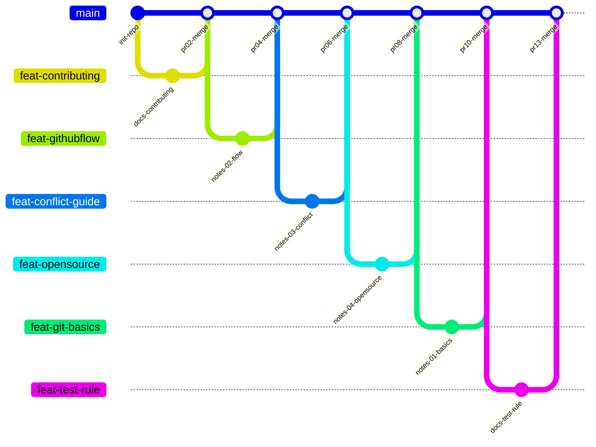
```mermaid
gitGraph
    commit id: "init-repo"
    branch feat-contributing
    checkout feat-contributing
    commit id: "docs-contributing"
    checkout main
    merge feat-contributing id: "pr02-merge"
    branch feat-githubflow
    checkout feat-githubflow
    commit id: "notes-02-flow"
    checkout main
    merge feat-githubflow id: "pr04-merge"
    branch feat-conflict-guide
    checkout feat-conflict-guide
    commit id: "notes-03-conflict"
    checkout main
    merge feat-conflict-guide id: "pr06-merge"
    branch feat-opensource
    checkout feat-opensource
    commit id: "notes-04-opensource"
    checkout main
    merge feat-opensource id: "pr08-merge"
    branch feat-git-basics
    checkout feat-git-basics
    commit id: "notes-01-basics"
    checkout main
    merge feat-git-basics id: "pr10-merge"
    branch feat-test-rule
    checkout feat-test-rule
    commit id: "docs-test-rule"
    checkout main
    merge feat-test-rule id: "pr13-merge"
```

### 5-2. 전체 1000스텝 완결 마스터 Git Graph (12개 PR + 2대 충돌 + 트러블슈팅 완결형)
- **충돌 1 (자명한 Hunk 충돌)**: 조은익 님의 `feature/eunik-style-rule`이 `main` 병합 충돌 직면 ➔ 로컬에서 `git merge origin/main`으로 `test`와 `style` 커밋 규칙을 모두 보존(Keep Both) 후 머지
- **리뷰 피드백 반영 루프**: 김건우 님의 `feature/gunwoo-template`에 김상교 님이 Request Changes ➔ 체크리스트 보강 추가 커밋 후 Re-approve 및 머지
- **충돌 2 (비자명 Rename vs Modify 충돌)**: 조은익 님의 `feature/eunik-reorganize` (`git mv notes/03... notes/advanced/...`) 머지 ➔ 김건우 님의 `feature/gunwoo-conflict-patch` (구 경로 수정) 충돌 직면 ➔ 3-Way Merge 원리로 로컬에서 통합 해결 후 머지
- **트러블슈팅 & 최종 제출**: 4인 트러블슈팅 종합(`docs/troubleshooting-log.md`) 및 `SUBMISSION.md`, `docs/git-history.txt` 최종 머지

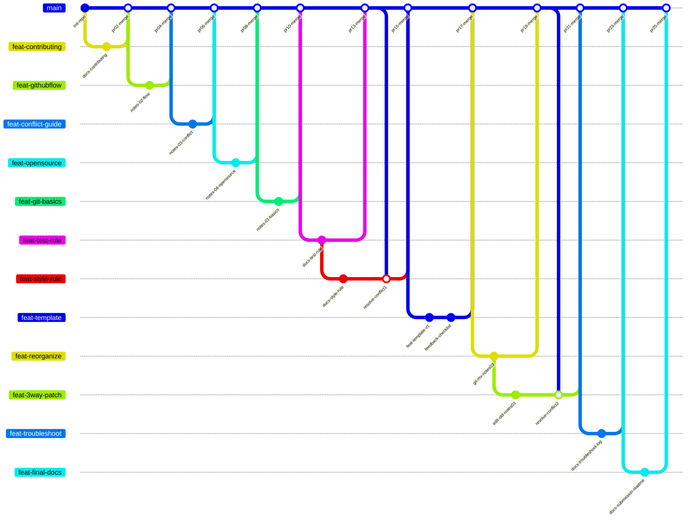
```mermaid
gitGraph
    commit id: "init-repo"
    branch feat-contributing
    checkout feat-contributing
    commit id: "docs-contributing"
    checkout main
    merge feat-contributing id: "pr02-merge"
    branch feat-githubflow
    checkout feat-githubflow
    commit id: "notes-02-flow"
    checkout main
    merge feat-githubflow id: "pr04-merge"
    branch feat-conflict-guide
    checkout feat-conflict-guide
    commit id: "notes-03-conflict"
    checkout main
    merge feat-conflict-guide id: "pr06-merge"
    branch feat-opensource
    checkout feat-opensource
    commit id: "notes-04-opensource"
    checkout main
    merge feat-opensource id: "pr08-merge"
    branch feat-git-basics
    checkout feat-git-basics
    commit id: "notes-01-basics"
    checkout main
    merge feat-git-basics id: "pr10-merge"
    branch feat-test-rule
    checkout feat-test-rule
    commit id: "docs-test-rule"
    branch feat-style-rule
    checkout feat-style-rule
    commit id: "docs-style-rule"
    checkout main
    merge feat-test-rule id: "pr13-merge"
    checkout feat-style-rule
    merge main id: "resolve-conflict1"
    checkout main
    merge feat-style-rule id: "pr15-merge"
    branch feat-template
    checkout feat-template
    commit id: "feat-template-v1"
    commit id: "feedback-checklist"
    checkout main
    merge feat-template id: "pr17-merge"
    branch feat-reorganize
    checkout feat-reorganize
    commit id: "git-mv-notes03"
    branch feat-3way-patch
    checkout feat-3way-patch
    commit id: "edit-old-notes03"
    checkout main
    merge feat-reorganize id: "pr19-merge"
    checkout feat-3way-patch
    merge main id: "resolve-conflict2"
    checkout main
    merge feat-3way-patch id: "pr21-merge"
    branch feat-troubleshoot
    checkout feat-troubleshoot
    commit id: "docs-troubleshoot-log"
    checkout main
    merge feat-troubleshoot id: "pr23-merge"
    branch feat-final-docs
    checkout feat-final-docs
    commit id: "docs-submission-readme"
    checkout main
    merge feat-final-docs id: "pr25-merge"
```
