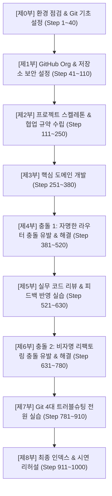

# B2-2 실전 협업 1000-Step 마스터 시나리오 (초심자용 엔드투엔드 가이드)

> **프로젝트명**: `TaskTracker CLI` (콘솔 기반 할 일 및 프로젝트 관리 도구)  
> **대상 인원**: **4인 1팀** (완전 초심자 기준: 모든 클릭, 모든 명령어, 모든 코드 포함)  
> **목표**: Codyssey B2-2 평가 기준 100% 만점 및 실무형 Git 협업 체득  
> **기준일자**: 2026-09-22

---

## 👥 1. 팀원 역할 및 가상 프로필 정의

모든 명령어와 예시는 아래 4명의 가상 계정을 기준으로 작성되었습니다. 실제 팀원들의 GitHub 아이디와 로컬 환경에 맞게 매핑하여 사용합니다.

| 역할 | 팀원 | GitHub ID | 담당 영역 및 핵심 임무 |
|:---:|:---:|:---:|:---|
| **팀원 A** | **김철수** (팀장) | `alice-dev` | Organization 생성, Branch Protection 설정, 프로젝트 스캐폴딩, `amend` 실습, 최종 `SUBMISSION.md` 취합 |
| **팀원 B** | **이영희** (코어) | `bob-coder` | 데이터 모델(`models.py`), `add` 명령어, 저장소 버그 수정, **충돌 1 & 충돌 2 상대방**, `reset` 실습 |
| **팀원 C** | **박민수** (기능) | `charlie-ops` | `list` 명령어, 통계 리포트(`stats.py`), **충돌 1 해결자 (자명한 충돌)**, `revert` 실습 |
| **팀원 D** | **최수진** (리팩터) | `david-qa` | 저장소 모듈 분리(`json_storage.py`), **충돌 2 해결자 (비자명 충돌)**, 리뷰 반영 실습, `stash` 실습 |

---

## 📑 2. 전체 시나리오 구조 (8대 파트 개요)



---

## [제0부] 환경 점검 & Git 기초 설정 (Step 1 ~ 40)

> **목표**: 팀원 전원의 로컬 터미널 환경을 통일하고, 줄바꿈(CRLF/LF) 문제 및 자격 증명 문제를 사전에 방지합니다.

### 0-1. Git 설치 및 버전 확인 (전원 수행)
- **Step 1**: 터미널(Windows: PowerShell 또는 Git Bash / Mac: Terminal)을 실행합니다.
- **Step 2**: Git 설치 여부를 확인합니다.
  ```bash
  git --version
  ```
  *(출력: `git version 2.40.0` 이상이어야 함)*
- **Step 3**: Python 설치 여부를 확인합니다.
  ```bash
  python --version
  # Windows에서 py 런처를 쓰는 경우: py --version
  ```
  *(출력: `Python 3.10` 이상 권장)*

### 0-2. Git 사용자 정보 및 줄바꿈(autocrlf) 설정 (전원 수행)
- **Step 4**: 본인의 GitHub 가입 이름과 이메일로 전역 설정을 등록합니다.
  ```bash
  git config --global user.name "본인영문이름"
  git config --global user.email "본인GitHub이메일@example.com"
  ```
- **Step 5**: 협업 시 OS 간 줄바꿈 문자 충돌(Windows `CRLF` vs Linux/Mac `LF`)을 방지하기 위한 필수 설정을 적용합니다.
  ```bash
  # Windows 사용자:
  git config --global core.autocrlf true

  # Mac / Linux 사용자:
  git config --global core.autocrlf input
  ```
- **Step 6**: 기본 브랜치 이름을 `main`으로 통일합니다.
  ```bash
  git config --global init.defaultBranch main
  ```
- **Step 7**: 설정이 정상 반영되었는지 확인합니다.
  ```bash
  git config --list --show-origin
  ```

---

## [제1부] GitHub Organization & 저장소 인프라 셋업 (Step 41 ~ 110)

> **목표**: 실무 표준인 Organization을 생성하고, 아무도 `main` 브랜치에 직접 푸시할 수 없도록 철통 방어 규칙을 구축합니다.

### 1-1. GitHub Organization 생성 (팀원 A 진행)
- **Step 41**: 웹 브라우저에서 GitHub 로그인 후 우측 상단 프로필 아이콘 클릭 ➔ **`Your organizations`** 메뉴로 이동합니다.
- **Step 42**: 우측 상단의 녹색 **`New organization`** 버튼을 클릭합니다.
- **Step 43**: 플랜 선택 화면에서 **`Free (Free forever)`** 플랜 아래의 **`Create a free organization`**을 클릭합니다.
- **Step 44**: Organization 이름을 입력합니다. (예: `task-tracker-flow-team`)
- **Step 45**: Contact email에 본인 이메일을 입력하고, 소유자 구분에 `My personal account`를 선택합니다.
- **Step 46**: 하단 약관 동의 체크박스 선택 후 **`Next`**를 클릭합니다.
- **Step 47**: 팀원 초대 화면에서 팀원 B(`bob-coder`), 팀원 C(`charlie-ops`), 팀원 D(`david-qa`)의 GitHub 아이디를 검색하여 추가합니다.
- **Step 48**: **`Complete setup`** 버튼을 눌러 Organization 생성을 완료합니다.

### 1-2. 팀원 초대 수락 및 권한 확인 (팀원 B, C, D 진행)
- **Step 49**: 팀원 B, C, D는 각자의 이메일함 또는 GitHub 알림 탭(`https://github.com/notifications`)을 확인합니다.
- **Step 50**: Organization 초대 알림에서 **`Join task-tracker-flow-team`** 버튼을 클릭하여 합류를 완료합니다.
- **Step 51**: 팀원 A는 Org 페이지의 **`People`** 탭에서 4명 모두 `Member`로 정상 등록되었는지 확인합니다.

### 1-3. 팀 공식 저장소 생성 (팀원 A 진행)
- **Step 52**: Organization 메인 페이지에서 녹색 **`Create a new repository`** 버튼을 클릭합니다.
- **Step 53**: 저장소 정보를 입력합니다:
  - Repository name: `task-tracker`
  - Description: `친구 3~5명과 함께 프로그램 만드는 법 연습하기 | TaskTracker CLI 실무 협업`
  - Public / Private: **`Public`** 선택 (평가 및 무료 플랜 보호 규칙 적용을 위해 필수)
  - Add a README file: **체크 해제** (로컬에서 직접 초기 커밋을 올리기 위함)
  - Add .gitignore: **None**
- **Step 54**: **`Create repository`** 버튼을 클릭합니다.

### 1-4. 팀원 A의 초기 로컬 스캐폴딩 및 최초 푸시 (팀원 A 진행)
- **Step 55**: 팀원 A는 본인의 작업 디렉터리에서 터미널을 열고 폴더를 생성합니다.
  ```bash
  mkdir task-tracker
  cd task-tracker
  ```
- **Step 56**: Git 저장소를 초기화합니다.
  ```bash
  git init -b main
  ```
- **Step 57**: 임시 `.gitkeep` 파일이 포함된 디렉터리 골격을 생성합니다.
  ```bash
  mkdir src docs tests
  # Windows PowerShell:
  New-Item -ItemType File src\.gitkeep, docs\.gitkeep, tests\.gitkeep
  # Linux/Mac/Git Bash:
  # touch src/.gitkeep docs/.gitkeep tests/.gitkeep
  ```
- **Step 58**: `.gitignore` 파일을 생성하고 기본 제외 항목을 작성합니다.
  ```text
  # .gitignore
  __pycache__/
  *.py[cod]
  .pytest_cache/
  .vscode/
  .idea/
  *.log
  ```
- **Step 59**: 최초 커밋을 생성합니다.
  ```bash
  git add .
  git commit -m "chore: Initialize repository structure with directories and gitignore"
  ```
- **Step 60**: 원격 저장소(`origin`)를 연결합니다.
  ```bash
  git remote add origin https://github.com/task-tracker-flow-team/task-tracker.git
  ```
- **Step 61**: 원격 `main` 브랜치로 첫 푸시를 수행합니다.
  ```bash
  git push -u origin main
  ```

### 1-5. ★ Branch Protection Rule 설정 (팀원 A 진행 - 필수 요구사항)
> **주의**: 이 설정이 켜지면 저장소 소유자를 포함한 누구도 `main` 브랜치에 직접 `git push`를 할 수 없게 됩니다.

- **Step 62**: GitHub 저장소 상단 메뉴에서 **`Settings`** 탭을 클릭합니다.
- **Step 63**: 좌측 사이드바에서 **`Branches`** 메뉴를 클릭합니다.
- **Step 64**: `Branch protection rules` 섹션 우측의 **`Add branch protection rule`** (또는 `Add rule`) 버튼을 클릭합니다.
- **Step 65**: **Branch name pattern** 입력창에 정확히 **`main`**을 입력합니다.
- **Step 66**: **`Protect matching branches`** 하위의 필수 항목들을 체크합니다:
  - [x] **Require a pull request before merging** (머지 전 PR 필수)
  - [x] **Require approvals** 숫자: **`1`** (최소 1인 승인 필수)
  - [x] **Dismiss stale pull request approvals when new commits are pushed** (새 커밋 푸시 시 기존 승인 초기화)
  - [x] **Do not allow bypassing the above settings** (관리자/팀장도 규칙 우회 금지)
- **Step 67**: 맨 하단으로 스크롤하여 녹색 **`Create`** (또는 `Save changes`) 버튼을 누르고 계정 비밀번호/OTP를 인증합니다.

### 1-6. 팀원 B, C, D의 로컬 클론 (팀원 B, C, D 진행)
- **Step 68**: 각자의 작업 컴퓨터에서 터미널을 엽니다.
- **Step 69**: 공식 저장소를 로컬로 복제합니다.
  ```bash
  git clone https://github.com/task-tracker-flow-team/task-tracker.git
  cd task-tracker
  ```
- **Step 70**: 클론된 브랜치가 `main`인지 확인합니다.
  ```bash
  git branch
  # 출력: * main
  ```

---

## [제2부] 프로젝트 스켈레톤 & 협업 규약 수립 (Step 111 ~ 250)

> **목표**: 4명의 팀원이 각자 1개의 이슈를 발행하고, 1개의 `feature/*` 브랜치에서 문서를 작성한 뒤, 상호 코드 리뷰를 거쳐 병합하는 기본 GitHub Flow 사이클을 완성합니다.

### 2-1. 팀원 A: README.md 및 프로젝트 소개 (PR #1)
- **Step 111**: GitHub **`Issues`** 탭에서 **`New issue`** 클릭.
- **Step 112**: 제목: `[docs] 기본 README.md 작성`, 본문: `프로젝트 소개 및 실행 환경 기술` 작성 후 **Submit new issue** 클릭 ➔ **이슈 #1 생성 확인**.
- **Step 113**: 팀원 A는 로컬 터미널에서 작업 브랜치를 분기합니다.
  ```bash
  git checkout main
  git pull origin main
  git checkout -b feature/a-readme
  ```
- **Step 114**: 루트 경로에 `README.md` 파일을 작성합니다:
  ```markdown
  # TaskTracker CLI

  Python 기반의 경량 콘솔 할 일 및 프로젝트 추적 관리 도구입니다.

  ## GitHub Flow 채택 이유
  - main 브랜치는 항상 안정적으로 배포 가능한 상태를 유지하기 위함
  - 브랜치를 기능 단위로 격리하여 팀원 간 충돌 범위를 최소화하기 위함
  - PR 기반 코드 리뷰를 통해 코드 품질과 변경 추적성을 확보하기 위함
  ```
- **Step 115**: 커밋하고 푸시합니다.
  ```bash
  git add README.md
  git commit -m "docs: Add initial README with project overview and GitHub Flow rationale"
  git push -u origin feature/a-readme
  ```
- **Step 116**: GitHub에서 **`Compare & pull request`**를 클릭하여 PR을 생성합니다.
  - 제목: `docs: Add initial README.md`
  - 본문: `Closes #1\n\nREADME 기본 문서 작성 완료.`
- **Step 117**: **팀원 B**가 PR 탭에서 팀원 A의 PR로 이동하여 `Files changed`를 확인하고 우측 상단 **`Review changes` ➔ `Approve`**를 제출합니다.
- **Step 118**: 팀원 A가 녹색 **`Merge pull request` ➔ `Confirm merge`**를 눌러 머지합니다.
- **Step 119**: 이슈 #1이 자동으로 `Closed` 되었는지 확인합니다.

### 2-2. 팀원 B: docs/CONTRIBUTING.md 협업 규약 작성 (PR #2)
- **Step 120**: 팀원 B가 이슈 발행: `[docs] 협업 규칙 및 커밋 컨벤션 가이드 문서화` ➔ **이슈 #2 생성 확인**.
- **Step 121**: 팀원 B의 로컬 터미널:
  ```bash
  git checkout main
  git pull origin main
  git checkout -b feature/b-contributing
  ```
- **Step 122**: `docs/CONTRIBUTING.md` 작성:
  ```markdown
  # 협업 규칙 가이드 (CONTRIBUTING)

  ## 1. 브랜치 전략
  - `main`: 상시 배포 가능 브랜치
  - `feature/<이름>-<기능>`: 신규 개발 단위 브랜치

  ## 2. 커밋 메시지 컨벤션
  - `feat:` 새로운 기능 추가
  - `fix:` 버그 수정
  - `docs:` 문서 수정
  - `refactor:` 기능 변경 없는 코드 구조 개선
  - `test:` 테스트 코드 추가 및 리팩토링
  ```
- **Step 123**: 커밋 및 푸시 후 PR 생성:
  ```bash
  git add docs/CONTRIBUTING.md
  git commit -m "docs: Add CONTRIBUTING guidelines with branch and commit conventions"
  git push -u origin feature/b-contributing
  ```
- **Step 124**: PR 본문에 **`Closes #2`**를 명시하고 생성.
- **Step 125**: **팀원 C**가 코드 리뷰 후 **`Approve`** 승인.
- **Step 126**: 팀원 B가 PR 머지 완료.

### 2-3. 팀원 C: Issue/PR 템플릿 & CODEOWNERS 설정 (PR #3)
- **Step 127**: 팀원 C가 이슈 발행: `[chore] GitHub Issue 및 PR 템플릿 추가` ➔ **이슈 #3 생성 확인**.
- **Step 128**: 팀원 C의 로컬 터미널:
  ```bash
  git checkout main
  git pull origin main
  git checkout -b feature/c-templates
  ```
- **Step 129**: `.github/pull_request_template.md` 생성:
  ```markdown
  ## 연결 이슈
  - Closes #

  ## 작업 내용 (What)
  - 

  ## 변경 사유 (Why)
  - 

  ## 체크리스트
  - [ ] 로컬 실행 및 테스트 통과 확인
  - [ ] main 브랜치 최신 상태 동기화 확인
  ```
- **Step 130**: `.github/CODEOWNERS` 생성:
  ```text
  * @task-tracker-flow-team/collaborators
  ```
- **Step 131**: 커밋, 푸시, PR 생성 (`Closes #3`).
- **Step 132**: **팀원 D**가 리뷰 후 **`Approve`**.
- **Step 133**: 팀원 C가 PR 머지 완료.

### 2-4. 팀원 D: 실습 증빙 양식(conflict/troubleshooting) 마련 (PR #4)
- **Step 134**: 팀원 D가 이슈 발행: `[docs] 충돌 해결 및 트러블슈팅 기록 템플릿 생성` ➔ **이슈 #4 생성 확인**.
- **Step 135**: 팀원 D의 로컬 터미널:
  ```bash
  git checkout main
  git pull origin main
  git checkout -b feature/d-log-templates
  ```
- **Step 136**: `docs/conflict-resolution.md` 헤더 양식 생성:
  ```markdown
  # Conflict Resolution Log

  과제 필수 요구사항에 따라 2회 이상의 충돌 해결 과정을 상세히 기록합니다. (비자명 충돌 1회 포함)
  ```
- **Step 137**: `docs/troubleshooting-log.md` 헤더 양식 생성:
  ```markdown
  # Troubleshooting Log

  Git 4대 트러블슈팅 도구(amend, reset, revert, stash)의 실무 적용 내역을 기록합니다.
  ```
- **Step 138**: 커밋, 푸시, PR 생성 (`Closes #4`).
- **Step 139**: **팀원 A**가 리뷰 후 **`Approve`**.
- **Step 140**: 팀원 D가 PR 머지 완료.

---

## [제3부] 핵심 도메인 개발 (Step 251 ~ 380)

> **목표**: 실제 동작하는 파이썬 애플리케이션의 뼈대(`models.py`, `storage.py`, `main.py`)를 개발합니다.

### 3-1. 팀원 A: 데이터 규격 정의 (models.py 개발 - PR #5)
- **Step 251**: 팀원 A 이슈 발행: `[feat] Task 데이터 모델 규격 정의` ➔ **이슈 #5**.
- **Step 252**: 로컬 브랜치 생성: `feature/a-models`
- **Step 253**: `src/models.py` 작성:
  ```python
  from dataclasses import dataclass, asdict
  from datetime import datetime

  @dataclass
  class Task:
      id: int
      title: str
      category: str
      completed: bool = False
      created_at: str = ""

      def __post_init__(self):
          if not self.created_at:
              self.created_at = datetime.now().strftime("%Y-%m-%d %H:%M:%S")

      def to_dict(self):
          return asdict(self)

      @classmethod
      def from_dict(cls, data: dict):
          return cls(**data)
  ```
- **Step 254**: 커밋, 푸시, PR 생성 (`Closes #5`), **팀원 B 승인**, 머지 완료.

### 3-2. 팀원 B: 영구 저장소 구현 (storage.py 개발 - PR #6)
- **Step 255**: 팀원 B 이슈 발행: `[feat] JSON 영구 저장소 구현` ➔ **이슈 #6**.
- **Step 256**: 로컬 브랜치 생성: `feature/b-storage`
- **Step 257**: `src/storage.py` 작성:
  ```python
  import json
  import os
  from typing import List
  from src.models import Task

  class Storage:
      def __init__(self, filepath: str = "tasks.json"):
          self.filepath = filepath

      def load_tasks(self) -> List[Task]:
          if not os.path.exists(self.filepath):
              return []
          try:
              with open(self.filepath, "r") as f:
                  data = json.load(f)
                  return [Task.from_dict(item) for item in data]
          except Exception:
              return []

      def save_tasks(self, tasks: List[Task]) -> None:
          with open(self.filepath, "w") as f:
              json.dump([t.to_dict() for t in tasks], f, indent=2)
  ```
- **Step 258**: 커밋, 푸시, PR 생성 (`Closes #6`), **팀원 C 승인**, 머지 완료.

### 3-3. 팀원 A: CLI 기본 라우터 골격 생성 (main.py 뼈대 - PR #7)
- **Step 259**: 팀원 A 이슈 발행: `[feat] CLI 메인 라우터 골격 생성` ➔ **이슈 #7**.
- **Step 260**: 로컬 브랜치 생성: `feature/a-main-skeleton`
- **Step 261**: `src/main.py` 기본 뼈대 작성:
  ```python
  import argparse

  def main():
      parser = argparse.ArgumentParser(description="TaskTracker CLI")
      subparsers = parser.add_subparsers(dest="command", help="Available commands")

      # [서브커맨드 등록 지점 - 각 기능별 커맨드가 등록될 공통 라우터 영역]

      args = parser.parse_args()

  if __name__ == "__main__":
      main()
  ```
- **Step 262**: 커밋, 푸시, PR 생성 (`Closes #7`), **팀원 D 승인**, 머지 완료.

---

## [제4부] ★ [실전 충돌 1] 자명한 충돌 (CLI 라우터 충돌) (Step 381 ~ 520)

> **시나리오**: 팀원 B는 `add`(추가) 기능을 개발하고, 팀원 C는 `list`(목록) 기능을 개발합니다. 둘 다 터미널에서 명령어를 받기 위해 `src/main.py`의 동일한 서브커맨드 등록부에 코드를 추가하여 **병합 충돌**을 경험합니다.

```
                    ┌─────────────────────────┐
                    │       src/main.py: 8줄   │
                    │   subparsers 등록 지점  │
                    └───────────┬─────────────┘
                                │
        ┌───────────────────────┴───────────────────────┐
        ▼                                               ▼
[팀원 B: feature/b-add]                        [팀원 C: feature/c-list]
subparsers.add_parser('add')                   subparsers.add_parser('list')
(PR #8 -> main에 먼저 머지됨!)                 (PR #9 머지 시도 -> CONFLICT 발생!)
```

### 4-1. 두 팀원의 동시 분기 (사전 상태 조성)
- **Step 381**: 팀원 B가 이슈 발행: `[feat] add 명령어 구현` ➔ **이슈 #8**.
- **Step 382**: 팀원 C가 이슈 발행: `[feat] list 명령어 구현` ➔ **이슈 #9**.
- **Step 383**: **팀원 B와 C는 정확히 동일한 최신 `main` 커밋에서 각자의 브랜치를 생성합니다.**
  ```bash
  # 팀원 B 로컬:
  git checkout main
  git pull origin main
  git checkout -b feature/b-add

  # 팀원 C 로컬:
  git checkout main
  git pull origin main
  git checkout -b feature/c-list
  ```

### 4-2. 팀원 B의 구현 및 main 선반영
- **Step 384**: 팀원 B는 `src/tasks.py`를 새로 만들어 `add_task` 함수를 구현합니다:
  ```python
  from src.models import Task
  from src.storage import Storage

  def add_task(title: str, category: str, storage: Storage) -> Task:
      tasks = storage.load_tasks()
      next_id = max([t.id for t in tasks], default=0) + 1
      new_task = Task(id=next_id, title=title, category=category)
      tasks.append(new_task)
      storage.save_tasks(tasks)
      return new_task
  ```
- **Step 385**: 팀원 B는 기존 `src/main.py`의 8번째 줄 아래에 `add` 서브커맨드를 추가합니다:
  ```python
  import argparse
  from src.storage import Storage
  from src.tasks import add_task

  def main():
      parser = argparse.ArgumentParser(description="TaskTracker CLI")
      subparsers = parser.add_subparsers(dest="command", help="Available commands")

      # [서브커맨드 등록 지점]
      add_p = subparsers.add_parser("add", help="Add new task")
      add_p.add_argument("--title", required=True)
      add_p.add_argument("--category", default="General")

      args = parser.parse_args()
      storage = Storage()
      if args.command == "add":
          t = add_task(args.title, args.category, storage)
          print(f"Task #{t.id} added successfully!")

  if __name__ == "__main__":
      main()
  ```
- **Step 386**: 팀원 B 커밋 및 푸시:
  ```bash
  git add src/tasks.py src/main.py
  git commit -m "feat: Add task functionality and register add command to main"
  git push -u origin feature/b-add
  ```
- **Step 387**: 팀원 B가 PR #8 생성 (`Closes #8`), **팀원 A가 코드 리뷰 후 `Approve`**, **PR #8이 `main`에 성공적으로 머지됩니다!**

### 4-3. 팀원 C의 구현 및 충돌 마주하기
- **Step 388**: 팀원 C는 팀원 B가 머지한 사실을 모른 채, 기존 상태의 `feature/c-list`에서 작업합니다.
- **Step 389**: 팀원 C는 `src/tasks.py`를 만들어 `list_tasks` 함수를 구현합니다:
  ```python
  from src.storage import Storage

  def list_tasks(storage: Storage):
      return storage.load_tasks()
  ```
- **Step 390**: 팀원 C는 기존 `src/main.py`의 동일한 8번째 줄 아래에 `list` 서브커맨드를 추가합니다:
  ```python
  import argparse
  from src.storage import Storage
  from src.tasks import list_tasks

  def main():
      parser = argparse.ArgumentParser(description="TaskTracker CLI")
      subparsers = parser.add_subparsers(dest="command", help="Available commands")

      # [서브커맨드 등록 지점]
      list_p = subparsers.add_parser("list", help="List all tasks")

      args = parser.parse_args()
      storage = Storage()
      if args.command == "list":
          for t in list_tasks(storage):
              print(f"[{t.id}] {t.title} ({t.category})")

  if __name__ == "__main__":
      main()
  ```
- **Step 391**: 팀원 C 커밋 및 푸시:
  ```bash
  git add src/tasks.py src/main.py
  git commit -m "feat: List tasks functionality and register list command to main"
  git push -u origin feature/c-list
  ```
- **Step 392**: 팀원 C가 GitHub에서 PR #9를 생성합니다 (`Closes #9`).
- **Step 393**: **GitHub 화면에 회색 경고 발생!**
  > **`This branch has conflicts that must be resolved`**  
  > `Conflicting files: src/main.py, src/tasks.py`

### 4-4. 로컬 터미널에서 충돌 정밀 해결 (팀원 C 진행)
- **Step 394**: 팀원 C는 웹에서 버튼을 누르지 않고, **실무 표준 방식대로 로컬 터미널**로 이동합니다.
- **Step 395**: 원격의 최신 `main` 변경사항을 가져옵니다.
  ```bash
  git fetch origin
  ```
- **Step 396**: 현재 작업 브랜치에 `main`을 병합하여 충돌을 로컬에 재현합니다.
  ```bash
  git merge origin/main
  ```
- **Step 397**: 터미널 출력 확인:
  ```text
  Auto-merging src/main.py
  CONFLICT (content): Merge conflict in src/main.py
  Auto-merging src/tasks.py
  CONFLICT (add/add): Merge conflict in src/tasks.py
  Automatic merge failed; fix conflicts and then commit the result.
  ```
- **Step 398**: `git status`로 충돌 상태를 확인합니다.
  ```text
  both modified:   src/main.py
  both added:      src/tasks.py
  ```
- **Step 399**: 에디터(VS Code)로 `src/tasks.py`를 열어 충돌 마커를 확인합니다:
  ```python
  <<<<<<< HEAD
  from src.storage import Storage

  def list_tasks(storage: Storage):
      return storage.load_tasks()
  =======
  from src.models import Task
  from src.storage import Storage

  def add_task(title: str, category: str, storage: Storage) -> Task:
      tasks = storage.load_tasks()
      next_id = max([t.id for t in tasks], default=0) + 1
      new_task = Task(id=next_id, title=title, category=category)
      tasks.append(new_task)
      storage.save_tasks(tasks)
      return new_task
  >>>>>>> origin/main
  ```
- **Step 400**: 충돌 마커를 지우고 두 함수가 모두 들어가도록 `src/tasks.py`를 통합 저장합니다:
  ```python
  from src.models import Task
  from src.storage import Storage

  def add_task(title: str, category: str, storage: Storage) -> Task:
      tasks = storage.load_tasks()
      next_id = max([t.id for t in tasks], default=0) + 1
      new_task = Task(id=next_id, title=title, category=category)
      tasks.append(new_task)
      storage.save_tasks(tasks)
      return new_task

  def list_tasks(storage: Storage):
      return storage.load_tasks()
  ```
- **Step 401**: 에디터로 `src/main.py`를 열고, 충돌 마커를 지운 뒤 `add`와 `list`가 순서대로 모두 등록된 완성 코드로 저장합니다:
  ```python
  import argparse
  from src.storage import Storage
  from src.tasks import add_task, list_tasks

  def main():
      parser = argparse.ArgumentParser(description="TaskTracker CLI")
      subparsers = parser.add_subparsers(dest="command", help="Available commands")

      # 1. add 명령어 등록 (팀원 B 기여)
      add_p = subparsers.add_parser("add", help="Add new task")
      add_p.add_argument("--title", required=True)
      add_p.add_argument("--category", default="General")

      # 2. list 명령어 등록 (팀원 C 기여)
      list_p = subparsers.add_parser("list", help="List all tasks")

      args = parser.parse_args()
      storage = Storage()
      if args.command == "add":
          t = add_task(args.title, args.category, storage)
          print(f"Task #{t.id} added successfully!")
      elif args.command == "list":
          for t in list_tasks(storage):
              status = "V" if t.completed else " "
              print(f"[{status}] #{t.id} {t.title} ({t.category})")

  if __name__ == "__main__":
      main()
  ```
- **Step 402**: 로컬에서 정상 실행되는지 직접 명령어로 검증합니다.

  ```bash
  python -m src.main add --title "첫 번째 할 일"
  python -m src.main list
  ```
- **Step 403**: 해결된 파일들을 스테이징하고 머지 커밋을 작성합니다.
  ```bash
  git add src/tasks.py src/main.py
  git commit -m "fix: Resolve merge conflict in main.py and tasks.py by combining add and list commands"
  ```
- **Step 404**: 원격 브랜치로 푸시합니다.
  ```bash
  git push origin feature/c-list
  ```
- **Step 405**: GitHub PR #8 화면을 새로고침하여 충돌이 해결되고 **녹색 `Mergeable`** 상태로 변경된 것을 확인합니다.
- **Step 406**: **팀원 D**가 PR #8에 코드 리뷰 후 **`Approve`**를 제출합니다.
- **Step 407**: PR #8이 `main`에 최종 머지됩니다.

### 4-5. 충돌 1 문서 기록 (팀원 C 진행)
- **Step 408**: 팀원 C는 `docs/conflict-resolution.md`에 [충돌 기록 1] 내용을 추가하여 PR을 올리고 머지합니다.
  - 참여자: 작성자 박민수(C), 상대방 이영희(B)
  - 대상 파일: `src/main.py`, `src/tasks.py`
  - 충돌 원인: 공통 라우터 등록 위치 동일 라인 동시 수정
  - 해결 전략: `Keep Both` (양쪽 커맨드 모두 통합 보존)

---

## [제5부] 실무 코드 리뷰 & 피드백 반영 실습 (Step 521 ~ 630)

> **목표**: 단순히 "LGTM" 승인만 하는 것이 아니라, **리뷰어가 실제 코드 라인에 개선을 요구하고, 작업자가 이를 수정 커밋으로 반영하여 승인받는 필수 평가 요건**을 충족합니다.

- **Step 521**: 팀원 D가 이슈 발행: `[feat] 완료 처리 complete 명령어 구현` ➔ **이슈 #9**.
- **Step 522**: 팀원 D 브랜치 분기: `feature/d-complete-task`
- **Step 523**: 팀원 D가 `complete_task` 로직을 작성합니다. (이때 고의로 존재하지 않는 task id에 대한 예외 처리를 누락합니다.)
- **Step 524**: 커밋 및 푸시 후 PR #10 생성 (`Closes #9`).
- **Step 525**: **팀원 A가 코드 리뷰를 수행합니다**:
  - PR의 `Files changed` 탭으로 이동.
  - `tasks.py`의 `complete_task` 함수 라인에 마우스를 올리고 `+` 버튼 클릭.
  - 코멘트 작성: *"존재하지 않는 task_id가 인자로 들어왔을 때 ValueError를 발생시키거나 예외 처리가 필요해 보입니다. 확인 부탁드립니다!"*
  - 우측 상단 `Finish your review`에서 **`Request changes`**를 선택하여 제출.
- **Step 526**: 팀원 D는 피드백을 확인하고 로컬에서 코드를 수정합니다:
  ```python
  def complete_task(task_id: int, storage: Storage) -> bool:
      tasks = storage.load_tasks()
      for t in tasks:
          if t.id == task_id:
              t.completed = True
              storage.save_tasks(tasks)
              return True
      raise ValueError(f"Task with ID {task_id} not found.")
  ```
- **Step 527**: 수정 내용을 추가 커밋하고 다시 푸시합니다.
  ```bash
  git add src/tasks.py
  git commit -m "refactor: Add ValueError exception handling for non-existent task ID as requested in review"
  git push origin feature/d-complete-task
  ```
- **Step 528**: 팀원 A가 추가된 커밋을 확인하고, 코멘트에 *"피드백 반영 감사드립니다. 깔끔하네요!"* 답글을 단 뒤 **`Approve`**로 상태를 변경합니다.
- **Step 529**: PR #10이 `main`에 성공적으로 머지됩니다. (리뷰 피드백 반영 증빙 확보 완료!)

---

## [제6부] ★ [실전 충돌 2] 비자명한 충돌 (Rename vs Modify) (Step 631 ~ 780)

> **상황**: 팀원 D는 저장소 구조 개선을 위해 `src/storage.py`를 `src/json_storage.py`로 파일명을 변경(`git mv`)하고 클래스명을 리팩토링합니다. 같은 시점에 팀원 B는 기존 `src/storage.py`의 한글 인코딩 버그를 수정하여 `main`에 먼저 머지합니다. 이로 인해 Git의 3-Way 병합 엔진에서 고난도 **비자명 충돌**이 터집니다.

```
                    ┌─────────────────────────┐
                    │      src/storage.py     │
                    └───────────┬─────────────┘
                                │
        ┌───────────────────────┴───────────────────────┐
        ▼                                               ▼
[팀원 D: feature/d-refactor]                    [팀원 B: feature/b-encoding-fix]
git mv storage.py json_storage.py              open(..., encoding='utf-8') 수정
(파일명 변경 및 내부 클래스 개선)               (기존 storage.py 파일 내용 수정)
                                                (PR #11 -> main에 먼저 머지됨!)
                                                                │
                                                                ▼
팀원 D가 main 병합 시: CONFLICT (rename/modify) 발생!
```

### 6-1. 두 팀원의 동시 분기
- **Step 631**: 팀원 D 이슈 발행: `[refactor] Storage 모듈 명칭을 JSONStorage로 명확화 및 파일 Rename` ➔ **이슈 #11**.
- **Step 632**: 팀원 B 이슈 발행: `[fix] Windows 환경 한글 입출력 보장을 위한 utf-8 인코딩 명시` ➔ **이슈 #12**.
- **Step 633**: 두 팀원 모두 최신 `main`에서 브랜치를 분기합니다:
  ```bash
  # 팀원 D:
  git checkout main && git pull origin main
  git checkout -b feature/d-refactor

  # 팀원 B:
  git checkout main && git pull origin main
  git checkout -b feature/b-encoding-fix
  ```

### 6-2. 팀원 D의 Rename 작업
- **Step 634**: 팀원 D는 Git 명령어로 파일 이름을 변경합니다.
  ```bash
  git mv src/storage.py src/json_storage.py
  ```
- **Step 635**: `src/json_storage.py` 파일 내부의 클래스명을 `Storage`에서 `JSONStorage`로 변경하고, **생성자(`__init__`)에 `auto_save: bool = True` 옵션을 추가**합니다:
  ```python
  """JSON 파일 기반 영구 저장소 구현체입니다. (v2 Refactored)"""
  import json
  import os
  from typing import List
  from src.models import Task

  class JSONStorage:
      def __init__(self, filepath: str = "tasks.json", auto_save: bool = True):
          self.filepath = filepath
          self.auto_save = auto_save

      def load_tasks(self) -> List[Task]:
          if not os.path.exists(self.filepath):
              return []
          try:
              with open(self.filepath, "r") as f:
                  data = json.load(f)
                  return [Task.from_dict(item) for item in data]
          except Exception:
              return []

      def save_tasks(self, tasks: List[Task]) -> None:
          with open(self.filepath, "w") as f:
              json.dump([t.to_dict() for t in tasks], f, indent=2)
  ```
- **Step 636**: 팀원 D 커밋:
  ```bash
  git add src/json_storage.py
  git commit -m "refactor: Rename storage.py to json_storage.py and add auto_save option"
  git push -u origin feature/d-refactor
  ```

### 6-3. 팀원 B의 내용 수정(Modify) 및 main 선반영
- **Step 637**: 팀원 B는 기존 `src/storage.py`에서 **D가 수정한 것과 동일한 생성자(`__init__`) 라인**에 `encoding: str = "utf-8"` 옵션을 추가합니다:
  ```python
  """JSON 영구 저장소 (v1.1 UTF-8 Patch)"""
  import json
  import os
  from typing import List
  from src.models import Task

  class Storage:
      def __init__(self, filepath: str = "tasks.json", encoding: str = "utf-8"):
          self.filepath = filepath
          self.encoding = encoding

      def load_tasks(self) -> List[Task]:
          if not os.path.exists(self.filepath):
              return []
          try:
              with open(self.filepath, "r", encoding=self.encoding) as f:
                  data = json.load(f)
                  return [Task.from_dict(item) for item in data]
          except Exception:
              return []

      def save_tasks(self, tasks: List[Task]) -> None:
          with open(self.filepath, "w", encoding=self.encoding) as f:
              json.dump([t.to_dict() for t in tasks], f, indent=2)
  ```
- **Step 638**: 팀원 B 커밋, 푸시 후 PR #12 생성 (`Closes #12`):
  ```bash
  git add src/storage.py
  git commit -m "fix: Explicitly specify utf-8 encoding in Storage file I/O operations"
  git push -u origin feature/b-encoding-fix
  ```
- **Step 639**: **팀원 C**가 리뷰 후 `Approve` ➔ **PR #12가 `main`에 먼저 머지 완료!**

### 6-4. 팀원 D의 비자명 충돌 직면 및 해결 절차
- **Step 640**: 팀원 D가 GitHub PR #13을 생성하자마자 충돌이 발생합니다.
- **Step 641**: 팀원 D는 로컬 터미널에서 최신 `main`을 병합합니다.
  ```bash
  git fetch origin
  git merge origin/main
  ```
- **Step 642**: **터미널에 실제 출력되는 충돌 경고 확인**:
  ```text
  Auto-merging src/json_storage.py
  CONFLICT (content): Merge conflict in src/json_storage.py
  Automatic merge failed; fix conflicts and then commit the result.
  ```
  *(참고: Git 구버전 또는 파일 이름 감지 임계값에 따라 `CONFLICT (rename/modify): src/storage.py renamed to src/json_storage.py in HEAD. Version origin/main of src/storage.py left in tree.`로 표시될 수도 있습니다.)*
- **Step 643**: `git status`를 입력하여 상태를 확인하고, 에디터로 `src/json_storage.py`를 엽니다:
  ```python
  <<<<<<< HEAD
      def __init__(self, filepath: str = "tasks.json", auto_save: bool = True):
          self.filepath = filepath
          self.auto_save = auto_save
  =======
      def __init__(self, filepath: str = "tasks.json", encoding: str = "utf-8"):
          self.filepath = filepath
          self.encoding = encoding
  >>>>>>> origin/main
  ```
  *(만약 `src/storage.py`가 디렉토리에 여전히 남아있다면, Git의 classic rename/modify 모드이므로 `git rm src/storage.py`로 구 파일을 정리합니다.)*
- **Step 644**: 해결 전략 실행 (3-Way Merge & Relocation):
  1. 상대방이 작성한 `encoding="utf-8"` 인자 및 `open(..., encoding=self.encoding)` 로직을 새 클래스 `JSONStorage`에 그대로 흡수합니다.
  2. 내가 추가한 `auto_save` 속성과 상대방의 `encoding` 속성을 모두 유지하도록 `src/json_storage.py`를 완성합니다:
  ```python
  """JSON 파일 기반 영구 저장소 구현체입니다. (v2 Final Merged)"""
  import json
  import os
  from typing import List
  from src.models import Task

  class JSONStorage:
      def __init__(self, filepath: str = "tasks.json", encoding: str = "utf-8", auto_save: bool = True):
          self.filepath = filepath
          self.encoding = encoding
          self.auto_save = auto_save

      def load_tasks(self) -> List[Task]:
          if not os.path.exists(self.filepath):
              return []
          try:
              with open(self.filepath, "r", encoding=self.encoding) as f:
                  data = json.load(f)
                  return [Task.from_dict(item) for item in data]
          except Exception:
              return []

      def save_tasks(self, tasks: List[Task]) -> None:
          with open(self.filepath, "w", encoding=self.encoding) as f:
              json.dump([t.to_dict() for t in tasks], f, indent=2)
  ```
  3. `src/tasks.py`와 `src/main.py`의 import 구문을 `from src.storage import Storage`에서 `from src.json_storage import JSONStorage`로 수정하고 인스턴스 생성도 `storage = JSONStorage()`로 맞춥니다.
- **Step 645**: 수정된 파일들을 스테이징하고 해결 머지 커밋을 생성합니다.
  ```bash
  git add src/json_storage.py src/tasks.py src/main.py
  git commit -m "fix: Resolve rename/modify conflict by unifying JSONStorage with utf-8 encoding"
  ```
- **Step 646**: 기능이 로컬에서 정상 동작하는지 테스트합니다:
  ```bash
  python -m src.main add --title "충돌2 해결 검증 태스크" --category "QA"
  python -m src.main list
  ```
  정상 작동을 확인한 뒤 원격 브랜치로 푸시합니다:
  ```bash
  git push origin feature/d-refactor
  ```
- **Step 647**: GitHub PR #13 화면에서 충돌이 자동으로 해소되었음을 확인하고, **팀원 B 승인** 후 `main`에 머지합니다.

### 6-5. 충돌 2 문서 기록 (팀원 D 진행)
- **Step 648**: `docs/conflict-resolution.md`에 [충돌 기록 2 - 비자명 충돌] 상세 내용을 기록하고 커밋합니다. (참여자 D & B, 발생 원인, 터미널 에러 문구 원문, `3-Way Merge & Content Relocation` 해결 전략, 커밋 해시 명시)

---

## [제7부] Git 4대 트러블슈팅 전원 분담 실습 (Step 781 ~ 910)

> **목표**: 4명의 팀원이 각각 1종씩 Git 핵심 트러블슈팅 명령어를 직접 의도적으로 실수하고 복구한 뒤, 터미널 로그를 `docs/troubleshooting-log.md`에 기록합니다.

### 7-1. 팀원 A: `git commit --amend` 실습
- **Step 781**: 팀원 A는 작업 브랜치에서 커밋을 올릴 때 일부러 오타를 냅니다.
  ```bash
  git commit -m "feat: Ad new utiliti functon"
  ```
- **Step 782**: 누락된 파일이나 오타를 수정하기 위해 `--amend`를 실행합니다:
  ```bash
  git commit --amend -m "feat: Add new utility function"
  ```
- **Step 783**: `git log -1`로 커밋 해시가 갱신되고 메시지가 깔끔하게 고쳐진 것을 확인하고 로그를 캡처합니다.

### 7-2. 팀원 B: `git reset --soft` 실습
- **Step 784**: 팀원 B는 불필요한 임시 디버깅 파일(`temp_debug.txt`)을 포함한 채 실수로 커밋합니다.
  ```bash
  git add .
  git commit -m "feat: Add feature with accidental temp file"
  ```
- **Step 785**: 변경한 코드는 그대로 유지하면서 커밋 기록만 취소하기 위해 `soft reset`을 실행합니다.
  ```bash
  git reset --soft HEAD~1
  ```
- **Step 786**: `git status`를 확인하여 작업 트리는 유지된 채 스테이징 상태로 안전하게 돌아왔음을 확인하고, 임시 파일을 삭제한 후 정상 커밋합니다.

### 7-3. 팀원 C: `git revert` 실습
- **Step 787**: 이미 `main`에 머지되었거나 원격에 푸시된 커밋에 치명적인 문제가 발견된 상황을 가정합니다.
- **Step 788**: 협업 브랜치에서는 강제 푸시(`push -f`)를 쓰면 동료들의 저장소가 꼬이므로, 안전하게 반대되는 변경을 담은 취소 커밋을 만듭니다:
  ```bash
  git log --oneline -n 3
  # 취소할 커밋 해시 확인 (예: a1b2c3d)
  git revert a1b2c3d --no-edit
  ```
- **Step 789**: 새로운 revert 커밋(`Revert "..."`)이 히스토리에 기록되고 안전하게 푸시되는 과정을 캡처합니다.

### 7-4. 팀원 D: `git stash` & `stash pop` 실습
- **Step 790**: 팀원 D가 `src/tasks.py`를 한창 수정하던 도중, 팀장으로부터 긴급 핫픽스 브랜치로 이동하라는 요청을 받습니다.
- **Step 791**: 아직 완성되지 않아 커밋할 수 없는 작업을 안전한 임시 공간에 저장합니다:
  ```bash
  git stash save "WIP: task filtering feature"
  ```
- **Step 792**: `git status`를 통해 작업 트리가 깨끗해진 것을 확인하고, 안전하게 다른 브랜치를 확인한 뒤 다시 복귀합니다.
- **Step 793**: 보관했던 작업 내용을 꺼내옵니다:
  ```bash
  git stash pop
  ```
- **Step 794**: 충돌 없이 작업 내용이 정확히 복원됨을 확인하고 로그를 기록합니다.

### 7-5. 트러블슈팅 종합 기록부 작성 및 PR 머지 (Step 795 ~ 800)
- **Step 795**: 팀원 A가 이슈를 생성하고 브랜치를 분기합니다:
  - 이슈: `[docs] Git 4대 트러블슈팅 전원 실습 기록부 작성` ➔ **이슈 #13**.
  ```bash
  git checkout main && git pull origin main
  git checkout -b docs/troubleshooting-log
  ```
- **Step 796**: 4명의 팀원이 터미널에서 캡처한 실제 명령어와 실행 로그를 취합하여 `docs/troubleshooting-log.md`를 작성합니다:
  ```markdown
  # Git Troubleshooting Practice Log

  | 팀원 | 명령어 | 의도적 유발 상황 | 해결 및 복구 결과 |
  |:---:|:---|:---|:---|
  | **팀원 A (김철수)** | `git commit --amend` | 커밋 메시지 오타 발생 | 최신 커밋 해시 재생성 및 메시지 수정 확인 |
  | **팀원 B (이영희)** | `git reset --soft` | 불필요한 디버그 임시 파일 포함 커밋 | 작업 트리 보존 상태로 커밋 취소 후 파일 제외 커밋 |
  | **팀원 C (박민수)** | `git revert` | main에 반영된 버그 커밋 긴급 롤백 | 히스토리 훼손 없이 역(Revert) 커밋 안전 머지 |
  | **팀원 D (최수진)** | `git stash` & `pop` | 작업 중 긴급 브랜치 전환 요청 | 미완성 변경사항 임시 격리 보관 후 무손실 복구 |
  ```
- **Step 797**: 커밋 및 푸시:
  ```bash
  git add docs/troubleshooting-log.md
  git commit -m "docs: Add Git troubleshooting practice log for 4 members"
  git push -u origin docs/troubleshooting-log
  ```
- **Step 798**: GitHub PR #14 생성 (`Closes #13`), **팀원 D**가 리뷰 후 `Approve` ➔ `main` 머지 완료!

---

## [제8부] 최종 인덱스 & 시연 리허설 (Step 911 ~ 1000)

> **목표**: 모든 산출물을 하이퍼링크로 연결한 `SUBMISSION.md`를 작성하고, 피어 리뷰 시연을 준비합니다.

### 8-1. 팀원 A: SUBMISSION.md 종합 인덱스 작성 및 최종 머지 (Step 911 ~ 940)
- **Step 911**: 팀원 A가 이슈 발행: `[docs] 최종 제출 문서 SUBMISSION.md 및 히스토리 로그 생성` ➔ **이슈 #14**.
- **Step 912**: 팀원 A가 최신 `main`에서 브랜치를 분기합니다:
  ```bash
  git checkout main && git pull origin main
  git checkout -b feature/a-submission-index
  ```
- **Step 913**: 루트 경로에 `SUBMISSION.md`를 생성하고 모든 팀원의 기여 내역을 표로 완벽히 정리합니다:
  ```markdown
  # Submission Index

  ## 1. 팀 및 저장소 정보
  - **팀명**: task-tracker-flow-team
  - **저장소 URL**: https://github.com/task-tracker-flow-team/task-tracker
  - **기본 브랜치**: `main`

  ## 2. 팀원별 기여 내역 (Issues / PRs / Reviews)
  | 팀원 | 역할 | 이슈 링크 | 병합된 PR 링크 | 동료 코드 리뷰 링크 |
  |:---:|:---:|:---|:---|:---|
  | **김철수 (팀원 A)** | 팀장/인프라 | #1, #5, #13, #14 | PR #1, PR #5, PR #14, PR #15 | PR #7 리뷰, PR #10 리뷰 |
  | **이영희 (팀원 B)** | 코어 개발 | #2, #6, #7, #12 | PR #2, PR #6, PR #7, PR #12 | PR #1 리뷰, PR #9 리뷰, PR #13 리뷰 |
  | **박민수 (팀원 C)** | 기능 개발 | #3, #8 | PR #3, PR #8, PR #9 (충돌 1 해결) | PR #2 리뷰, PR #6 리뷰, PR #12 리뷰 |
  | **최수진 (팀원 D)** | 리팩터링 | #4, #9, #10, #11 | PR #4, PR #10 (리뷰 반영), PR #13 (충돌 2 해결) | PR #3 리뷰, PR #8 리뷰, PR #14 리뷰 |

  ## 3. 핵심 문서 바로가기
  - [협업 규칙 가이드 (CONTRIBUTING.md)](docs/CONTRIBUTING.md)
  - [충돌 해결 기록부 (conflict-resolution.md)](docs/conflict-resolution.md)
  - [트러블슈팅 실습 기록부 (troubleshooting-log.md)](docs/troubleshooting-log.md)
  ```
- **Step 914**: 터미널에서 전체 Git 히스토리 텍스트를 추출하여 `docs/git-history.txt`로 저장합니다:
  ```bash
  git log --oneline --graph --all > docs/git-history.txt
  ```
- **Step 915**: 커밋 후 푸시하고 최종 PR #15를 생성합니다 (`Closes #14`):
  ```bash
  git add SUBMISSION.md docs/git-history.txt
  git commit -m "docs: Add final SUBMISSION.md index and git history log"
  git push -u origin feature/a-submission-index
  ```
- **Step 916**: **팀원 B와 C**가 최종 점검 리뷰를 수행하고 `Approve`를 누른 뒤 `main`에 최종 머지 완료!

### 8-2. 최종 자가 점검 (Step 941 ~ 970)
- [x] Branch Protection이 활성화되어 있어 `main` 직접 푸시가 차단되는가?
- [x] 모든 작업이 GitHub Issue와 연동되어 PR에 `Closes #`가 기재되었는가?
- [x] 팀원 1인당 최소 2개 이상의 PR이 머지되었는가?
- [x] 팀원 1인당 최소 2개 이상의 의미 있는 코드 리뷰를 남겼는가?
- [x] 최소 1회 이상 코드 리뷰 피드백을 받아 수정 커밋을 추가한 이력이 있는가?
- [x] 충돌 해결 기록이 2건 이상이며, 그중 1건이 비자명 충돌(Rename vs Modify)인가?
- [x] 트러블슈팅 4종(`amend`, `reset`, `revert`, `stash`)에 전원이 참여했는가?

### 8-3. 피어 리뷰 구두 질의응답 5대 기출 리허설 (Step 971 ~ 1000)
- **질문 1**: "왜 Organization을 만들었나요?"
  - 👉 *"실무 엔터프라이즈 환경과 동일하게 전원 동등한 관리자 권한을 갖고 조직 단위 Branch Protection을 적용하기 위해 옵션 A를 선택했습니다."*
- **질문 2**: "비자명 충돌은 왜 일어났고 어떻게 풀었나요?"
  - 👉 *"파일 Rename(`storage.py` ➔ `json_storage.py`)과 상대방의 버그 수정이 동시에 일어나 Git ORT 엔진에서 `rename/modify` 충돌이 발생했습니다. 3-Way 병합 원리에 따라 바뀐 새 파일에 수정 코드를 이식하고 구 파일을 `git rm` 처리하여 해결했습니다."*
- **질문 3**: "`reset`과 `revert`의 차이는?"
  - 👉 *"로컬 실수 커밋은 `reset --soft`로 작업 트리를 유지하며 조용히 지웠고, 이미 원격 `main`에 공유된 커밋은 동료들의 저장소 꼬임을 막기 위해 `revert`로 역커밋을 생성해 안전하게 취소했습니다."*
- **질문 4**: "`stash`는 언제 썼나요?"
  - 👉 *"작업 중 커밋하기 애매한 미완성 코드를 임시 보관(`stash save`)하고 다른 긴급 브랜치를 다녀온 뒤 `stash pop`으로 깔끔하게 복원했습니다."*
- **질문 5**: "충돌 마커에서 HEAD가 뜻하는 바는?"
  - 👉 *"`<<<<<<< HEAD`는 현재 내가 머지를 수행 중인 로컬 체크아웃 브랜치 내용이고, `>>>>>>>`는 당겨오려는 원격 main의 최신 내용입니다."*
