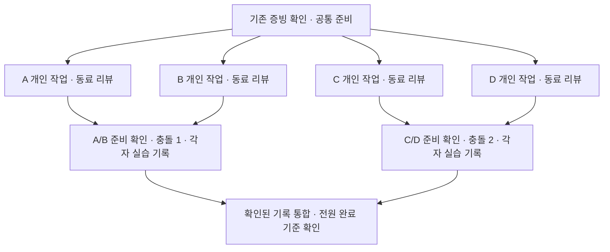

# B2-2 재시도: 4인 병렬 협업 실행안

작성일: 2026-09-29. 상태: **재시도 실행 설계안 — 팀 실습 전**.

기존 4명과 학습 노트 주제를 유지하는 기본안이다. 이름이 바뀌면 A~D 담당자만 교체한다. 이전 기록을 활용하고, 부족한 요건에 실제 작업을 배정한다. 이 문서가 재시도 운영 기준이며, 요구사항 판정은 [instruction.md](../instruction.md)와 [evalutation.md](../evalutation.md)를 따른다. 화면 조작과 명령을 차례대로 따라갈 때는 [0016 상세 실행서](0016_b2-2-retry-step-by-step.md)를 사용한다.

## 1. 이번에 바꾸는 운영 방식

| 항목 | 새 운영 기준 |
| --- | --- |
| 작업 시작 | 선행 산출물이 준비된 사람부터 자기 작업 시작 |
| Issue·PR | 작업 이름으로 배정하고 실제 생성된 URL을 기록. 번호·생성 순서 예약 금지 |
| 기여도 | 전원 최소 PR 2개·타인 PR 리뷰 2개·본인 PR 리뷰 반영 1회. 필요한 추가 PR 허용 |
| 리뷰 | 실제 파일을 보고 질문·개선점 제시. 작성자가 근거 또는 수정으로 응답 |
| 충돌 | 서로 다른 파일에서 두 쌍이 진행. 쌍 내부에서만 분기 기준과 병합 순서 조율 |
| 기록 | 수행자가 자기 작업 PR에 기록. 마지막에는 확인된 기록을 필수 문서에 통합 |
| 진행 관리 | 저장소의 운영 Issue 한 곳에 개인별 실제 링크와 부족분 표시 |

근거: 개인별 기준은 원문 110~126행, 충돌은 128~147행, 협업 가이드와 결과물은 149~167행. 학습 노트는 허용된 결과물이며 README 목차와 전원의 기여 커밋이 필요하다.

## 2. 시작 지점: 이미 한 일을 확인한다

기본 경로는 기존 팀 저장소의 정상적인 `main`과 유효한 기록을 이어 쓰는 것이다. 이 분석 저장소는 실행 대상이 아니다. 팀 저장소를 정한 뒤 아래 표를 운영 Issue에 옮겨 각자 본인 행을 채운다.

| 담당자 | 병합된 본인 PR URL 2개 이상 | 타인 PR 리뷰 URL 2개 이상 | 본인 PR의 리뷰→반영 링크 | 노트 기여 커밋 | 실습 기록 | 다음 부족분 |
| --- | --- | --- | --- | --- | --- | --- |
| A 김상교 | 확인 전 | 확인 전 | 확인 전 | 확인 전 | 확인 전 | 확인 후 배정 |
| B 장양환 | 확인 전 | 확인 전 | 확인 전 | 확인 전 | 확인 전 | 확인 후 배정 |
| C 조은익 | 확인 전 | 확인 전 | 확인 전 | 확인 전 | 확인 전 | 확인 후 배정 |
| D 김건우 | 확인 전 | 확인 전 | 확인 전 | 확인 전 | 확인 전 | 확인 후 배정 |

- 각자 자기 링크를 입력하고 지정 리뷰어가 실제 작성자·병합 상태·코멘트 내용을 확인한다. PR 링크만 있고 리뷰 근거가 없으면 리뷰 칸은 미확인으로 둔다.
- 팀 전체 충돌 2건, 4종 트러블슈팅, 보호 규칙도 확인한다. 기존 충돌을 인정하려면 당시 브랜치·파일·해결 내용과 PR/커밋이 연결되어야 한다.
- 이미 충족한 작업은 반복하지 않는다. 노트가 이미 있으면 필요한 설명·사용 예시를 보완할 수 있으나, 횟수만 채우는 빈 변경은 만들지 않는다.
- 당시 기록이 없는 명령 출력이나 리뷰를 소급해서 만들지 않는다. 확인되지 않는 실습은 새로 수행하고 새 기록으로 구분한다.
- 로컬 사본은 2026-09-22의 PR 7개 병합 상태까지만 확인했다. 현재 원격 완료 여부는 이 표를 작성할 때 확인한다. [보관된 Git 로그](0014_b2-2-all-teams-git-logs.md) 참조.
- 새 저장소에서 시작하기로 팀이 정한 경우에는 개인별 증빙을 새 저장소에서 확보한다. 이전 저장소의 PR 수를 새 제출 저장소에 합산하지 않는다. 기존 저장소·브랜치는 보존한다.

## 3. 역할과 작업 소유권

아래 두 작업은 **새로 시작할 때의 기본 8개 PR 후보**다. 기존 기록을 이어 쓰면 부족분만 선택한다. 공통 준비와 최종 통합에 추가 PR이 필요할 수 있으며, 전체 PR 수를 8개로 제한하지 않는다.

| 담당자 | 개인 작업: 노트 PR | 실습 작업: 별도 PR | 협업 가이드 분담 | 충돌 역할 |
| --- | --- | --- | --- | --- |
| A 김상교 | Git 기초 노트 | amend 수행·기록 + A/B 공통 파일 변경 | 브랜치·커밋 규칙 | A/B 쌍의 선병합 |
| B 장양환 | GitHub Flow 노트 | reset --soft 수행·기록 + 충돌 1 해결·기록 | Issue·PR 작성 규칙 | A/B 쌍의 해결자 |
| C 조은익 | 충돌 원리 노트 | 원격 커밋 revert 수행·기록 + C/D 공통 파일 변경 | 충돌 대응 흐름 | C/D 쌍의 선병합·저장소 권한 설정 |
| D 김건우 | PR·리뷰 노트 | stash 수행·기록 + 충돌 2 해결·기록 | 리뷰 품질·응답 규칙 | C/D 쌍의 해결자 |

노트 PR의 리뷰어는 **A의 PR→B, B의 PR→C, C의 PR→D, D의 PR→A**로 배정한다. 실습 PR은 **A의 PR→C, B의 PR→D, C의 PR→A, D의 PR→B**로 배정한다. 두 작업을 모두 수행하면 전원이 서로 다른 동료 PR을 2회 리뷰한다. 화살표 뒤 사람이 리뷰어다.

기존 PR을 재사용하거나 대체 리뷰어가 처리한 경우에는 실제 표로 개인별 리뷰 부족분을 다시 계산한다. 본인 PR 승인이나 다른 사람 계정으로 작업한 기록은 대체 증빙으로 쓰지 않는다.

### 파일 배치

팀 저장소의 목표 배치다. 기존 노트 파일명은 유지해도 된다.

```text
README.md
SUBMISSION.md
.github/pull_request_template.md
notes/                              # 각자 소유한 노트 1개
src/practice/review-request.md       # A/B 충돌 실습 파일
src/practice/sync-timing.md          # C/D 충돌 실습 파일
docs/CONTRIBUTING.md
docs/conflict-resolution.md         # 충돌 2건의 완결된 기록
docs/troubleshooting-log.md         # 4종의 완결된 기록
docs/evidence/a-amend.md            # A가 수행 즉시 작성
docs/evidence/b-reset.md            # B가 수행 즉시 작성
docs/evidence/c-revert.md           # C가 수행 즉시 작성
docs/evidence/d-stash.md            # D가 수행 즉시 작성
docs/evidence/conflict-ab.md        # B가 작성, A가 사실 확인
docs/evidence/conflict-cd.md        # D가 작성, C가 사실 확인
docs/git-history.txt
```

일반 작업에서는 자기 노트·증빙 파일만 수정한다. 공유 인덱스와 필수 종합 문서는 공통 준비/마지막 통합 때 담당자가 갱신한다. `src/practice/`의 두 파일만 의도적으로 충돌시키며, 서로 다른 쌍은 상대 파일을 수정하지 않는다.

## 4. 선행 조건과 진행 순서



이미 완료된 개인 작업은 해당 경로를 통과한 것으로 처리한다. 한 쌍은 다른 쌍의 작업 완료를 기다리지 않는다. 리뷰는 PR이 열리는 즉시 시작하며, 충돌과 무관한 개인 실습 준비도 대기 중 진행할 수 있다.

### 공통 준비: 시작 때 한 번

1. C가 팀 저장소의 접근 권한, 기본 브랜치 `main`, PR 필수·승인 최소 1명·직접 push 차단을 확인한다. 소유자 우회 여부도 확인해 실제 운영 규칙과 맞춘다. 설정 화면/조회 결과를 기록한다. 보호 확인을 위해 불필요한 커밋을 `main`에 push하는 실험은 요구하지 않는다.
2. A~D는 위 표의 담당 절을 준비 Issue에 직접 작성한다. A가 이를 `docs/CONTRIBUTING.md`에 합치고 분담한 사람과 원문 댓글 링크를 남긴다. 기존 가이드가 있으면 누락된 절만 보완한다.
3. 필요한 공통 파일을 준비 PR로 올리고 B가 리뷰한다. PR 템플릿에는 `What / Why / How / Closes #실제번호`를 넣는다. GitHub Flow 선택 이유는 가이드에 3줄 이내로 적는다. 커밋 규칙은 변경 목적·대상이 드러나게 정하고, 이 작업공간에서는 AGENTS.md의 Lore 규칙도 준수한다.
4. 두 충돌 파일의 기본 문장을 준비한다. 필수 종합 문서와 제출 인덱스는 준비 중인 항목을 미완료로 표시한다. 아직 없는 파일을 완료 링크로 제공하지 않는다.
5. 준비 PR이 병합되면 개인 작업을 시작한다. 기존 파일·설정이 이미 준비됐다면 해당 준비 작업은 생략한다. 새 저장소는 호스트가 최소 README로 기본 브랜치를 최초 생성한 뒤 보호를 설정하고, 이후 작업은 PR로 진행한다.

### 개인 작업: 4명 동시 진행

- 각자는 노트 작업과 실습 작업에 각각 Issue를 만들고 준비된 `main`에서 `feature/<담당자>-<작업>` 브랜치를 만든다. PR의 `Closes`에는 실제 발급된 Issue 번호를 넣고 기본 브랜치 `main`을 대상으로 한다.
- 본인 노트에 본인이 설명할 수 있는 예시를 작성하고 검증한다. 이 단계에서는 다른 사람 노트나 공통 목차를 동시에 편집하지 않는다.
- 리뷰어는 구체적인 파일·문장·예시를 근거로 질문 또는 개선점을 남긴다. 작성자는 답하거나 수정하고, 리뷰어가 확인한 뒤 승인한다. 준비/통합 PR에도 같은 품질 기준을 적용한다.
- **전원 본인 PR의 리뷰 반영 1회**를 조기에 확인한다. 설명 보완·예시 수정 등 실제 필요한 내용을 반영하고 코멘트와 반영 커밋/답글을 연결한다. 감사 인사나 “다음에 반영”만으로 완료 처리하지 않는다. 의도적인 오류나 복사할 리뷰 대사를 준비하지 않는다. `Request changes` 클릭 자체는 필수가 아니다.
- 병합 가능한 PR부터 병합한다. 번호 순서나 네 사람의 동시 완료를 기다리지 않는다. 함께 접속한 실습 시간에 리뷰 응답이 15분 넘게 없으면 다른 팀원에게 배정을 바꾸고 원래 리뷰어의 부족분을 표에 남긴다. 이는 운영 기본값이며 팀 일정에 맞게 조정한다.

## 5. 충돌 실습: 두 쌍이 각각 한 번

같은 파일의 같은 hunk를 다르게 수정한 충돌도 과제의 비자명 기준을 충족한다([instruction.md](../instruction.md), 130~134행). 기본안은 이 유형 2건이다. 파일 이동 실습을 추가하고 싶다면 별도 학습 작업으로 배정한다. 기존 충돌 1건이 검증됐다면 부족한 1건만 수행한다.

| 쌍 | 파일과 기본 문장 | 선병합자의 변경 | 해결자의 변경 | 해결 시 보존할 의미 |
| --- | --- | --- | --- | --- |
| A/B | `src/practice/review-request.md`: `리뷰 요청: PR 링크를 공유한다.` | A: `리뷰 요청: PR 링크와 변경 이유를 공유한다.` | B: `리뷰 요청: PR 링크와 검증 결과를 공유한다.` | 변경 이유와 검증 결과 모두 전달 |
| C/D | `src/practice/sync-timing.md`: `동기화: 원격 변경을 확인한다.` | C: `동기화: 작업 시작 전에 원격 변경을 확인한다.` | D: `동기화: PR 병합 전에 원격 변경을 확인한다.` | 작업 시작 전과 병합 전 모두 확인 |

각 쌍이 아래 절차를 독립적으로 수행한다.

1. 준비된 기본 문장이 `main`에 있는지 확인한다. 두 사람 모두 작업 트리가 깨끗한 상태에서 `git fetch origin`을 실행하고, `git rev-parse origin/main`의 **같은 기준 SHA**를 Issue에 기록한다. 서로 다른 로컬 저장소에서 그 SHA를 기준으로 각자 실습 브랜치를 만든다.
2. 표의 **기존 한 줄을 각각 다르게 교체**한다. 두 사람 모두 변경을 커밋하고 자기 실습 PR을 연 뒤에 선병합한다. 자기 트러블슈팅 기록도 이 PR에 포함한다. 두 브랜치 준비를 확인하기 전 한쪽부터 병합하지 않는다.
3. A 또는 C의 PR에서 지정 리뷰어의 실질 코멘트와 작성자의 응답/수정을 확인하고, 검토·승인 후 `main`에 병합한다. B 또는 D는 해당 선병합을 확인한 뒤 자기 브랜치에서, 커밋하지 않은 변경이 없는 상태로 `git fetch origin` → `git merge origin/main`을 수행한다. 이때 다른 쌍의 파일 변경이 함께 들어오는 것은 허용한다.
4. 해결 전에 `git status`, `git diff`, 실제 충돌 마커를 파일 또는 캡처로 보존한다. 두 부모의 커밋 SHA와 대상 파일을 기록한다. Git의 출력 문구를 예상 문장으로 대체하지 않는다.
5. 두 변경의 의미를 모두 만족하도록 문장을 합치고 검토한다. B/D가 자기 충돌 기록 파일을 작성하고 A/C가 사실을 확인한다. 실제 대상 파일과 기록 파일만 `git add`한 뒤 병합 커밋을 만들고 push한다.
6. 지정 리뷰어가 해결 결과와 기록에 실질 코멘트를 남기고 작성자가 응답/수정한다. 최종 변경을 확인·승인한 뒤 PR을 병합한다. 운영 표에 해결 PR·커밋·문서 링크를 추가한다.

자동 병합됐다면 충돌 실습 완료로 세지 않는다. 기준 SHA, 변경한 한 줄, 두 브랜치의 준비 시점을 확인한다. 진행 중인 충돌을 중단하려면 깨끗한 상태에서 시작했는지와 증빙 보존을 확인한 뒤 `git merge --abort`를 사용한다. 자동 병합이 이미 끝났다면 `--abort`로 되돌리지 않는다. 실제 상태에서 새 작업 브랜치/PR을 만들고 좁은 파일 범위로 다시 실습하며, 기존 기록을 유지한다.

## 6. 트러블슈팅: 수행자가 자기 PR에 기록

모든 실습은 개인 `feature/*` 브랜치에서 진행한다. 원격 공유 전후의 구분을 먼저 확인하고, 다른 사람 작업이나 `main`의 이력을 재작성하지 않는다. 명령을 그대로 실행하기 전에 현재 브랜치·대상 커밋·작업 상태를 확인한다.

| 담당자 | 실습 범위 | 수행과 필수 증빙 |
| --- | --- | --- |
| A | 아직 push하지 않은 최신 개인 커밋의 구체적인 메시지 오타 | `git commit --amend`로 메시지 수정. 전후 `git log -1`의 해시·메시지를 함께 보존 |
| B | 아직 push하지 않은 최신 개인 실습 커밋 | `git reset --soft HEAD~1`. 전후 HEAD와 `git status`, `git diff --cached`로 커밋 취소와 staged 변경 보존 확인 후 의미 있는 메시지로 재커밋 |
| C | 자기 실습 브랜치의 별도 예시 파일에 한정한 일반 커밋 | 원본 커밋을 먼저 push하고 성공 확인. `git revert <확인한 원본 SHA>` 후 다시 push. 원본·역커밋 URL, 두 push 결과와 파일 복구 상태 기록. 충돌용 문장 변경 커밋과 분리 |
| D | 이미 추적되는 자기 실습 파일의 미커밋 변경 | `git stash push` 전후 상태 기록 → 다른 브랜치 전환·확인 → 원래 브랜치 복귀 → `git stash pop`. 복원된 diff 확인 후 필요한 변경 커밋. 새 미추적 파일을 쓸 때만 `-u` 필요 여부 판단 |

amend/reset은 해당 로컬 실습 커밋을 최초 push하기 전에 수행한다. revert의 원본과 역커밋은 리뷰 가능한 원격 기록으로 남긴다. 이 설계에서는 PR을 merge commit으로 병합해 실습 커밋을 추적하기 쉽게 하고, 제출 확인 전 관련 원격 브랜치/증빙을 정리하지 않는다. 어떤 실습도 횟수를 맞추기 위한 강제 push를 요구하지 않는다.

각 기록 파일은 다음 항목을 작성하고 **같은 PR에서 검토**받는다.

```text
참여자와 역할 / 작업 Issue·PR / 실행 환경(Git 버전·셸)
상황: 대상 파일·브랜치·기준 커밋, 재현에 필요한 초기 내용
절차: 실제 명령과 적용 순서
관찰: 실행 전후 출력, 해시·diff·충돌 마커 또는 캡처
결과: 최종 파일 상태와 커밋 URL
판단: 해결 방법을 선택한 이유, 공유 이력에 미치는 영향, 주의점
```

추가 충돌이나 예상과 다른 출력이 발생하면 그 차이도 기록한다. PR이 병합되어도 기록을 읽고 과정을 설명할 수 없으면 재현성 항목은 미완료로 둔다.

## 7. 마지막 통합: 검토된 기록을 제출물로 연결

A가 통합 Issue/PR을 만들고, 개인 증빙을 바탕으로 다음 파일만 정리한다. 수행 사실을 다시 수집하지 않도록 각자는 앞 단계에서 자기 기록과 운영 표를 완성한다. A가 지연되면 표와 파일을 받은 다른 팀원이 통합을 맡을 수 있다.

- `docs/conflict-resolution.md`: 두 사건 각각의 참여자·상황·실제 마커·해결 절차와 이유·결과/PR·배운 점을 **문서 본문에** 싣는다. 상세 증빙 링크도 연결한다.
- `docs/troubleshooting-log.md`: 4종 각각의 참여자·재현 조건·명령·전후 결과·주의점/선택 이유를 **문서 본문에** 싣는다. 링크 목록만으로 대체하지 않는다.
- `SUBMISSION.md`: 팀원별 Issue, 병합된 PR, 본인이 쓴 리뷰, 본인 PR의 리뷰 반영, 노트 기여, 실습 문서 링크를 구분한다. 팀 전체 보호 설정·충돌 2건·4종 실습·Git 로그도 연결한다.
- `README.md`: 실제로 존재하는 팀원별 노트 목차와 사용/열람 방법을 제공한다.
- `docs/git-history.txt`: `git fetch origin` 뒤 `git log --oneline --graph --all`을 UTF-8 텍스트로 보존하고 채집 시점·기준 SHA를 적는다. 통합 PR 자신의 최종 병합은 파일 생성 이후이므로 통합 PR URL을 보충한다. 로그 파일이 자기 자신을 포함하도록 반복 커밋하지 않는다.

B는 A의 개인 증빙, C는 B의 것, D는 C의 것, A는 D의 것을 확인한다. D가 통합 PR의 실질 코멘트·작성자 응답·승인을 확인하고 병합한다. 자신이 작성한 PR의 승인자는 반드시 다른 사람으로 바꾼다. 캡처는 설정 상태나 사라질 수 있는 실행 출력을 보완할 때 사용하며, 장수 목표는 두지 않는다.

## 8. 완료 기준과 구두 확인

| 판정 대상 | 완료를 증명하는 조건 | 과제 근거 |
| --- | --- | --- |
| 팀·보호 | 4명 권한 확인, main 보호, PR 경유·최소 1명 승인 | instruction 71~85행 |
| 추적성·규칙 | 작업 Issue 연결, 전 PR What/Why/How, 모든 PR마다 실질 코멘트 ≥1·작성자와 상호작용 ≥1, 의미 있는 커밋 메시지, 가이드 5개 항목·Flow 이유 3줄 이내 | instruction 87~108, 117~126, 149~157행 |
| 개인별 기여 | 각자 병합 PR ≥2, 타인 PR 실질 리뷰 ≥2, 본인 PR 리뷰 반영 ≥1 | instruction 110~126행 |
| 충돌 | 실제 해결 2건, 그중 최소 1건 같은 hunk 또는 이동/수정 기준, 필수 문서의 재현 가능한 기록 | instruction 128~135, 211행 |
| 트러블슈팅 | amend·soft reset·원격 커밋 revert·stash/pop의 실제 기록, 전원 기록 작성 참여 | instruction 137~147행 |
| 결과물·제출 | 전원 노트 ≥1·기여 커밋 ≥1, README 목차, SUBMISSION, 필수 문서 3종, Git 로그 | instruction 35~50, 159~167행 |
| 설명 가능성 | 각자 자신의 PR·실습 링크로 What/Why/How 설명, evalutation 21~34행의 모든 질문에 답함(운영 규칙, main 안정성, 승인·Issue 연동 이유, revert 선택 이유, 충돌 마커·판단 기준 포함) | evalutation 19~35행 |
| 상황 대응 | 전원이 아래 3가지 상황의 대응 순서를 자기 말로 설명 | evalutation 37~42행 |

구두 확인은 서로 질문하고 실제 작업 링크로 답한다. 공통 정답 대사를 암기하는 방식으로 대체하지 않는다.

1. 긴급 수정: 최신 main에서 작은 feature 브랜치 → Issue/PR → 리뷰·승인 → 병합·결과 확인. 보호 설정을 유지하면서 처리할 수 있는가?
2. 의미 없는 메시지를 이미 push한 경우: 공유 이력을 보존하면서 PR/Issue에 해시별 목적을 보완할 수 있는가? 메시지 문제와 잘못된 변경 내용을 되돌리는 revert를 구분하는가?
3. 같은 영역 충돌이 반복되는 경우: 공동 편집 지점·작업 크기·브랜치 유지 기간을 살펴보고 분담과 동기화 시점을 조정할 수 있는가?

**종료 조건:** 표의 모든 항목을 실제 링크·파일·설명으로 확인했을 때 완료한다. 누락이 있으면 해당 사람/작업만 보완하고, 전원이 다시 처음부터 진행하지 않는다. 예정된 작업을 완료로 표기하지 않는다.

## 9. 설계 검토 범위와 참고

이 문서는 로컬 과제 원문, 이전 대본, 보관된 Git 기록을 근거로 작성했다. 실제 팀원의 새 실습이나 GitHub 설정 변경은 수행하지 않았다. 실습 시간 단축은 아직 측정하지 않았으며, 실행 시 리뷰 대기와 전체 진행 중단이 발생한 지점을 운영 Issue에 짧게 남겨 다음 조정에 사용한다.

- [GitHub Flow](https://docs.github.com/en/get-started/using-github/github-flow): 작업 브랜치, PR, 검토와 병합.
- [Issue와 PR 연결](https://docs.github.com/en/issues/tracking-your-work-with-issues/using-issues/linking-a-pull-request-to-an-issue): 실제 Issue 번호와 기본 브랜치 대상 병합.
- [git merge](https://git-scm.com/docs/git-merge): 충돌 상태와 중단 조건.
- [git reset](https://git-scm.com/docs/git-reset), [git revert](https://git-scm.com/docs/git-revert), [git stash](https://git-scm.com/docs/git-stash): 각 명령의 상태 변화와 적용 범위.
