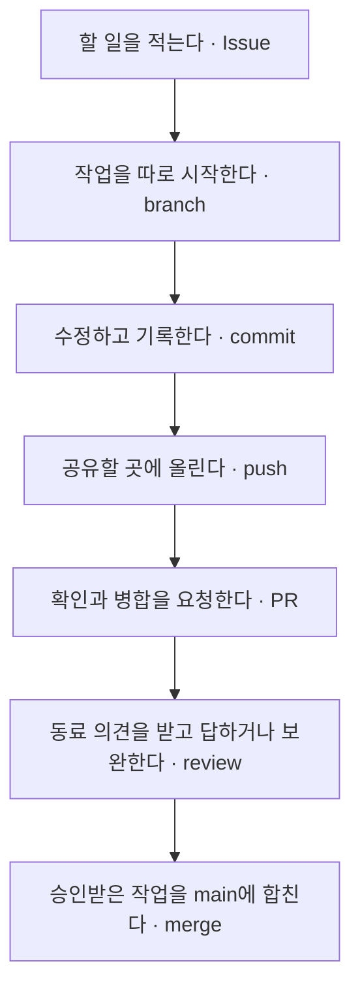

# 개발 1주일차를 위한 B2-2 설명서

**이번 과제는 네 사람이 공부 노트를 함께 만들면서, 서로의 작업을 확인하고 합치는 연습입니다.**

어려운 용어를 외우기보다 한 사람이 작업을 시작해서 끝내는 모습을 따라가 봅시다. 먼저 1~3번만 읽어도 전체 흐름을 이해할 수 있습니다. 나머지는 궁금할 때 읽으면 됩니다.

`test/`는 GitHub 없이 한 모의 연습입니다. 2번에서는 실제 팀 작업의 흐름을 설명하고, 6번에서 이번 모의 연습과의 차이를 살펴봅니다.

이 문서는 이해를 돕는 설명서입니다. 실제 작업을 시작할 때의 순서와 명령어는 [0016 실행서](0016_b2-2-retry-step-by-step.md), 정확한 과제 조건은 [과제 원문](../instruction.md)을 봅니다.

## 1. 지금 무엇을 만들고 있나요?

우리 팀은 **Git 공부 노트 모음**을 만들기로 했습니다. Git은 파일의 변경 기록을 관리하는 도구입니다.

| 사람 | 맡은 글 |
| --- | --- |
| 김상교 | Git으로 파일을 저장하고 기록하는 방법 |
| 장양환 | 팀원이 따로 작업한 뒤 합치는 순서 |
| 조은익 | 같은 부분을 서로 다르게 고쳤을 때 해결하는 방법 |
| 김건우 | 다른 사람의 글을 검토하고 의견을 주는 방법 |

각자 글만 써서 제출하면 끝나는 과제는 아닙니다. **내가 쓴 글을 동료에게 보여 주고, 의견을 받아 보완하고, 팀 결과물에 합치는 과정**을 연습합니다.

Git에서 관리하는 프로젝트 폴더와 변경 기록을 **저장소(repository, 줄여서 repo)**라고 부릅니다. 아래에서 말하는 파일은 이 저장소 안에 있습니다. `.md`는 제목이나 목록을 간단한 기호로 적을 수 있는 글 파일입니다.

## 2. 김건우가 글 하나를 완성하는 과정

아래는 이해를 위한 예시 대화입니다. 실제 제출할 리뷰는 그때의 파일을 읽고 작성합니다.

### ① “리뷰하는 방법을 정리하겠습니다”라고 할 일을 적습니다

할 일을 적은 항목을 **이슈(Issue)**라고 합니다. 오류 신고뿐 아니라 새로 할 작업도 적을 수 있습니다.

> 할 일: 좋은 리뷰를 쓰는 방법 정리하기  
> 담당자: 김건우  
> 끝났다고 판단할 기준: 예시가 있고, 동료가 읽고 확인했다.

이렇게 적어 두면 팀원들이 누가 무엇을 하는지 알 수 있습니다.

### ② 팀의 기본 버전에서 내 작업을 따로 시작합니다

작업을 따로 이어 가는 갈래를 **브랜치(branch)**라고 합니다. **main도 브랜치입니다.** 팀이 함께 쓰는 기본 버전으로 정한 브랜치의 이름이 main입니다.

김건우는 `feature/d-notes`라는 이름의 브랜치를 만듭니다. `d`는 이 연습에서 김건우를 뜻하고, `notes`는 노트 작업이라는 뜻입니다.

이 브랜치에서 글을 고치는 동안 그 변경이 main에 바로 들어가지는 않습니다. 별도의 폴더를 복사한다는 뜻은 아닙니다. 같은 저장소 안에서 작업 기록을 나눠 관리합니다.

### ③ 글을 쓰고, 의미 있는 지점에서 기록을 남깁니다

파일을 저장한 다음 “여기까지 한 작업”을 Git에 기록하는 것을 **커밋(commit)**이라고 합니다.

```text
파일 편집·저장 → 이번에 기록할 변경 선택(add) → 변경 기록 만들기(commit)
```

`add`는 다음 커밋에 넣을 내용을 고르는 과정입니다. 이렇게 선택된 내용을 **스테이징 영역(staging area)**에 있다고 말합니다.

커밋에는 “리뷰할 때 확인할 항목을 추가했다”처럼 무엇을 했는지 설명을 붙입니다. 파일의 저장 버튼을 누르는 것과 커밋을 만드는 것은 별개입니다.

### ④ 동료가 볼 수 있도록 올립니다

**내 컴퓨터에서 작업하는 곳은 로컬(local)**, **팀이 함께 접근하는 다른 저장소는 원격(remote)**이라고 합니다. 실제 팀 활동에서는 GitHub에 원격 저장소를 둡니다. GitHub는 Git 저장소를 공유하고 검토할 수 있는 서비스입니다.

내 커밋을 원격 저장소에 보내는 것이 **푸시(push)**입니다.

**커밋은 내 컴퓨터에 기록하기, 푸시는 그 기록을 공유할 곳으로 보내기입니다.** 커밋만 했다고 동료의 컴퓨터에 자동으로 전달되지는 않습니다.

### ⑤ “제 작업을 확인하고 합쳐 주세요”라고 요청합니다

이 요청이 **PR(Pull Request)**입니다. PR을 열었다고 바로 합쳐지는 것은 아닙니다.

김건우는 다음 세 가지를 적어 동료에게 보여 줍니다.

| PR에서 쓰는 말 | 쉬운 질문 | 김건우의 예시 |
| --- | --- | --- |
| What | 무엇을 바꿨나요? | 리뷰할 때 확인할 목록을 추가했습니다. |
| Why | 왜 바꿨나요? | 무엇을 봐야 할지 막막한 팀원을 돕기 위해서입니다. |
| How | 제대로 됐는지 어떻게 확인했나요? | 글을 미리보기로 읽고, 예시가 이해되는지 확인했습니다. |

처음 적은 할 일도 연결합니다. 예를 들어 `Closes #12`는 “이 작업이 끝나면 12번 할 일도 완료됩니다”라는 연결 표시입니다. 실제 GitHub에서는 PR을 기본 브랜치에 합치는 등의 조건이 맞으면 해당 Issue가 자동으로 닫힙니다. 번호는 실제 만들어진 번호를 사용합니다.

### ⑥ 동료가 읽고, 나는 의견에 답합니다

다른 사람의 변경을 읽고 확인하는 것이 **리뷰(review)**입니다.

> 김상교: “좋은 리뷰의 실제 예시가 한 개 있으면 더 이해하기 쉽겠습니다.”  
> 김건우: “예시를 추가했습니다. 이 문장이 충분한지 확인해 주세요.”

김건우는 같은 브랜치에서 글을 보완하고, 새 커밋을 만들고, 다시 푸시합니다. 그러면 기존 PR에 추가 변경이 나타납니다. 작은 수정마다 PR을 새로 만드는 것은 아닙니다.

항상 상대 말대로 수정해야 하는 것은 아닙니다. 이미 설명이 충분하다면 위치와 이유를 답할 수도 있습니다. 중요한 것은 **실제 내용을 보고 의견을 주고받는 것**입니다.

### ⑦ 확인된 작업을 팀의 기본 버전에 합칩니다

리뷰어가 최종 변경을 확인하고 합쳐도 좋다고 표시하는 것이 **승인(Approve)**입니다. 실제로 작업을 합치는 것이 **병합 또는 머지(merge)**입니다.

이제 김건우가 쓴 글이 main에 들어갑니다. 다른 팀원은 원격의 최신 기록을 가져와 자기 컴퓨터에도 반영할 수 있습니다. 이때 쓰는 `pull`은 변경을 가져와 현재 브랜치에 반영하는 명령입니다. **PR과 `git pull`은 서로 다른 것입니다.**



이처럼 main에서 작업을 나누고, PR로 검토한 뒤 다시 합치는 방식을 **GitHub Flow**라고 부릅니다.

## 3. 왜 “노트 PR”과 “실습 PR”이 따로 있나요?

과제에서는 **각자 PR을 최소 2개 만들고, 그 작업이 main에 합쳐져야** 합니다. 그래서 우리 계획에서는 두 가지 일을 맡깁니다.

| 구분 | 하는 일 | 올리는 내용 |
| --- | --- | --- |
| 노트 PR | 내가 공부한 내용을 설명하기 | 내가 쓴 공부 노트 |
| 실습 PR | Git으로 실수를 수습하고 함께 수정하기 | 연습용 파일과 실제 수행 기록 |

이 두 이름은 우리 팀이 작업을 구분하려고 붙인 말입니다. GitHub에 서로 다른 종류의 PR 버튼이 있는 것은 아닙니다.

**PR 하나에 커밋은 여러 개 있을 수 있습니다.** “처음 글 작성 → 리뷰를 받아 예시 추가”처럼 커밋이 두 개여도, 같은 PR에서 진행했다면 PR은 하나입니다.

PR 2개만 채우면 끝나는 것도 아닙니다. 각자 남의 PR을 최소 2개 리뷰하고, 본인 PR에서 받은 의견을 최소 1번 반영한 기록도 필요합니다. 이때 의미 있는 수정이나 근거 있는 답글을 남깁니다.

## 4. “충돌”은 무엇이 부딪힌다는 뜻인가요?

**같은 부분을 두 사람이 다르게 고쳐서, Git이 어떤 내용으로 합칠지 정하지 못하는 상황**입니다.

`test/`에서는 처음에 이런 문장이 있었습니다.

> 리뷰 요청: PR 링크를 공유한다.

두 사람이 이 버전에서 각자 작업을 시작했습니다.

| 사람 | 고친 문장 |
| --- | --- |
| 김상교 | 리뷰 요청: PR 링크와 **변경 이유**를 공유한다. |
| 장양환 | 리뷰 요청: PR 링크와 **검증 결과**를 공유한다. |

김상교의 작업이 main에 먼저 들어갔습니다. 장양환이 그 main을 자기 브랜치에 합치자 같은 줄이 서로 달라 충돌이 났습니다.

파일에는 아래처럼 양쪽 내용의 경계를 표시하는 기호가 나타납니다. 이 기호들을 **충돌 마커**라고 합니다.

```text
<<<<<<< HEAD
리뷰 요청: PR 링크와 검증 결과를 공유한다.
=======
리뷰 요청: PR 링크와 변경 이유를 공유한다.
>>>>>>> main
```

위쪽은 현재 장양환 브랜치의 내용, 아래쪽은 합치려는 main의 내용입니다. 둘 다 필요한 정보이므로, 사람끼리 확인해서 다음 문장으로 고칩니다.

> 리뷰 요청: PR 링크, 변경 이유와 검증 결과를 공유한다.

그다음 수정된 파일을 커밋하고 동료에게 다시 확인받습니다. **기호만 지우는 것이 아니라, 두 사람이 무엇을 하려 했는지 이해하고 최종 내용을 정하는 것이 충돌 해결입니다.**

연습할 때는 두 사람이 같은 시작 버전에서 작업하고, 양쪽 수정이 준비됐는지 확인한 뒤 먼저 합칠 사람을 정합니다. 한 사람이 이미 합친 다음 다른 사람이 그 최신 버전에서 시작하면 같은 충돌이 나지 않을 수 있습니다.

문서에 나오는 **비자명 충돌**은 이번 과제에서 정한 충돌 조건의 이름입니다. 위처럼 같은 부분을 다르게 고쳐 생긴 충돌도 그 조건에 해당합니다.

## 5. 실수했을 때 쓰는 네 가지 도구

처음에는 명령어 철자보다 **어떤 상황에 쓰는지**를 구분하면 됩니다. 아래는 우리 실습에서의 용도입니다.

| 도구 | 상황 | 결과 |
| --- | --- | --- |
| `amend` | 아직 푸시하지 않은 마지막 커밋의 설명에 오타가 났다. | 마지막 커밋을 새 커밋으로 교체한다. 이번에는 설명만 고친다. |
| `reset --soft HEAD~1` | 마지막 커밋을 취소하고 다시 묶어서 기록하고 싶다. | 커밋 위치를 한 단계 전으로 돌리되, 파일 내용과 add한 상태는 남긴다. |
| `revert` | 이미 공유한 커밋의 **파일 변경 내용**을 취소해야 한다. | 기존 기록을 남겨 두고, 해당 변경을 취소하는 새 커밋을 추가한다. |
| `stash` / `stash pop` | 글을 쓰다가 잠깐 다른 브랜치를 봐야 한다. | 미완성 변경을 잠시 보관하고, 돌아와서 다시 꺼낸다. |

예를 들어 “오타가 난 커밋 설명”과 “잘못 추가한 파일 내용”은 서로 다른 문제입니다. **설명에 오타가 났다고 revert를 하면, 멀쩡한 파일 변경까지 취소할 수 있습니다.** 이미 공유한 설명의 오타는 PR에 올바른 뜻을 덧붙이는 식으로 처리합니다.

`reset --soft`의 “내용을 남긴다”는 설명을 다른 reset 옵션에도 적용하면 안 됩니다. 특히 `--hard`는 작업 내용을 버릴 수 있어 결과가 다릅니다.

stash 실습에서는 Git이 이미 관리하던 파일을 사용했습니다. 기본 stash가 새로 만든 파일까지 모두 보관하는 것은 아닙니다.

이번 분담은 김상교가 amend, 장양환이 reset, 조은익이 revert, 김건우가 stash입니다. 네 명이 네 가지를 전부 반복해야 한다는 뜻은 아닙니다. 팀 전체에서 네 종류를 수행하고 각자 최소 하나의 기록 작성에 참여합니다.

## 6. 그런데 `test/`에는 GitHub가 없잖아요?

맞습니다. `test/`는 **이 컴퓨터에서 네 사람 역할을 나누어 해 본 연습 저장소**입니다.

| 항목 | `test/`에서 한 일 |
| --- | --- |
| 파일 수정, 커밋, 브랜치, 병합 | 실제 Git으로 실행했습니다. |
| 충돌 해결과 네 가지 복구 실습 | 실제로 실행하고 기록을 남겼습니다. revert의 원격 공유 상황은 가정했습니다. |
| 네 사람의 이름 | 커밋 작성자 이름을 바꿔 역할을 표시했습니다. 네 사람이 각자 로그인했다는 뜻은 아닙니다. |
| Issue·PR·리뷰 | 문서와 병합 커밋의 설명에 모의 기록을 남겼습니다. 실제 GitHub PR은 아닙니다. |
| GitHub 접근 권한·main 보호 설정 | 실제 팀 저장소에서 별도로 확인할 항목입니다. |

따라서 커밋 설명에 `Merge pull request #3`이라고 써 있어도, 그것만으로 GitHub에 PR #3이 생기지는 않습니다. `Closes #3`도 이 로컬 연습에서는 연결 표시입니다. 실제 GitHub Issue가 자동으로 닫힌 것은 아닙니다.

**main 보호 설정**은 “검토 없이 main에 바로 올리지 못하게 하는 규칙”입니다. 실제 팀 활동에서는 PR을 거치고, 최소 한 명이 승인하도록 설정합니다.

## 7. 파일이 많은데 어디부터 보면 되나요?

우선 [김건우의 공부 노트](../test/notes/04-open-source.md)를 열어 보세요. 팀원이 만들려던 결과물이 어떤 글인지 먼저 보는 것입니다.

그다음 필요에 따라 아래 문서를 찾으면 됩니다.

| 궁금한 것 | 볼 파일 | 쉬운 뜻 |
| --- | --- | --- |
| 누가 무슨 일을 맡았지? | [issues.md](../test/docs/issues.md) | 할 일 목록 |
| 무슨 작업을 내고 어떤 의견을 받았지? | [pull-requests.md](../test/docs/pull-requests.md) | 모의 제출·검토 기록 |
| 함께 작업할 때 어떤 약속을 지키지? | [CONTRIBUTING.md](../test/docs/CONTRIBUTING.md) | 팀의 작업 규칙 |
| 충돌은 어떻게 풀었지? | [conflict-resolution.md](../test/docs/conflict-resolution.md) | 충돌 해결 이야기 |
| 실수를 어떻게 수습했지? | [troubleshooting-log.md](../test/docs/troubleshooting-log.md) | 네 가지 도구의 사용 기록 |
| 실제로 무슨 결과가 나왔지? | [evidence 폴더](../test/docs/evidence/) | 명령 실행 전후의 구체적인 기록 |
| 팀원별 작업을 어디서 확인하지? | [SUBMISSION.md](../test/SUBMISSION.md) | 제출 자료를 모아 둔 안내표 |

이런 기록을 **증빙**이라고 부릅니다. “완료했습니다”라는 말에 더해, 무엇을 어떻게 했고 실제 결과가 어땠는지 확인할 수 있게 남긴 자료입니다.

문서에서 `8ca401f`처럼 보이는 글자는 커밋을 찾아갈 때 쓰는 식별자의 짧은 형태입니다. **해시 또는 SHA**라고 부르지만, 지금은 “특정 작업 기록을 가리키는 번호”라고 이해하면 됩니다. 외울 필요는 없습니다.

## 8. 처음 읽은 뒤 이 세 가지만 말해 보세요

1. **커밋과 푸시는 어떻게 다른가요?** 내 컴퓨터에 작업을 기록하는 것과, 그 기록을 공유할 저장소에 보내는 것입니다.
2. **PR과 머지는 어떻게 다른가요?** 작업을 확인하고 합쳐 달라는 요청과, 실제로 합치는 행동입니다.
3. **동료 리뷰는 왜 받나요?** 내가 놓친 부분을 다른 사람이 찾아 주고, 함께 쓸 결과물을 서로 이해하기 위해서입니다.

이 세 가지가 구분되면 [김건우의 노트](../test/notes/04-open-source.md)를 읽고 “내가 리뷰어라면 어떤 부분을 더 설명해 달라고 할까?”를 한 문장 적어 보세요. 지금 단계에서는 그 한 번으로 시작하면 됩니다.

---

이 설명은 [과제 원문](../instruction.md), [팀 작업 계획](0015_b2-2-retry-workflow.md), 현재 `test/`의 파일과 Git 기록을 바탕으로 작성했습니다. 실제 제출 준비에는 개인별 기여뿐 아니라 팀 전체 충돌 2건·복구 실습 4종·협업 문서·GitHub 설정도 필요합니다. 전체 확인표는 [0015의 완료 기준](0015_b2-2-retry-workflow.md#8-완료-기준과-구두-확인)을 봅니다.
